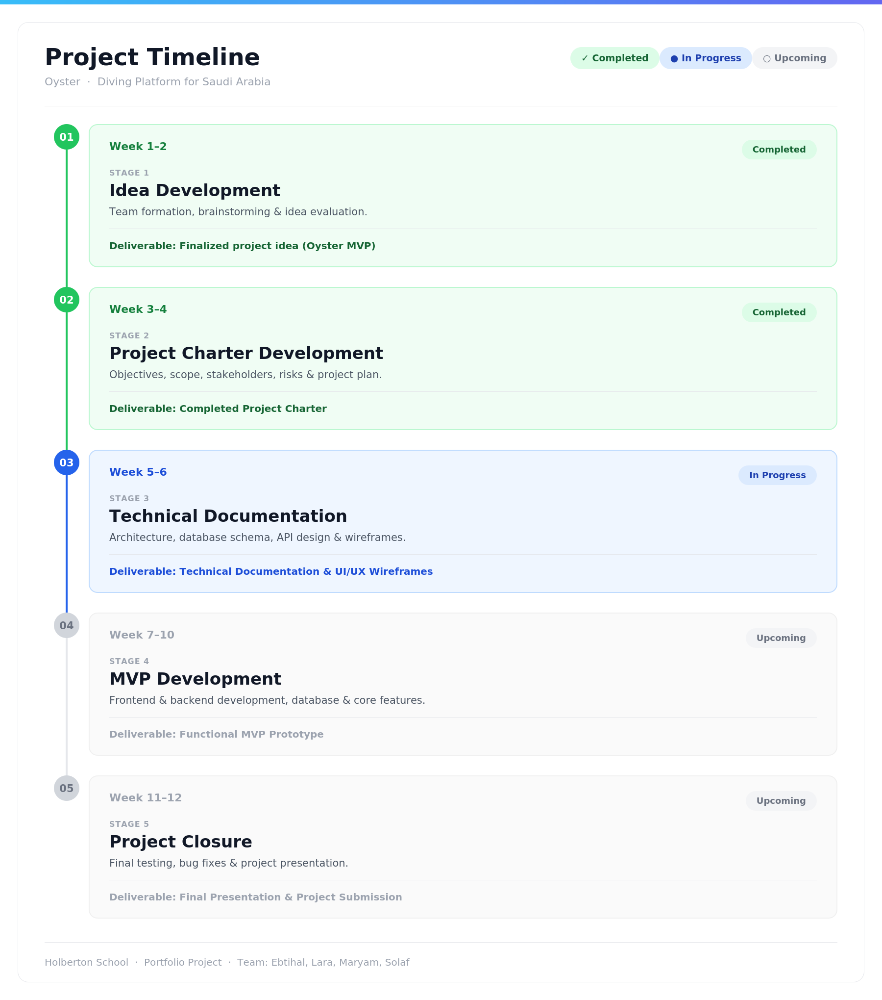

# 0. Define Project Objectives

## Project Purpose

Oyster is a digital platform designed to connect users with diving centers, instructors, diving trips, and training courses across Saudi Arabia through one unified platform.

The project aims to simplify the process of discovering and booking diving experiences while supporting the growth of marine tourism in Saudi Arabia in alignment with Vision 2030. Oyster also helps diving centers improve their visibility and reach a wider audience through an organized and user-friendly digital solution.

---

## Project Objectives

1. Provide users with an easy-to-use platform to browse diving centers, trips, and courses in different Saudi coastal cities during the MVP phase.

2. Reduce the time users spend searching for reliable diving services from several hours to less than 10 minutes through a centralized platform.

3. Enable diving centers to receive booking requests and improve customer engagement by offering a simple digital booking and review system within the first MVP release.

 # 1. Identify Stakeholders and Team Roles

## Stakeholders

| Type | Stakeholder | Role / Interest |
|---|---|---|
| Internal | Project Team Members | Responsible for planning, designing, developing, and documenting the project. | 
| External | Diving Centers | Service providers who will list trips, courses, and diving services on the platform. |
| External | Diving Instructors | Offer diving courses and training opportunities through the platform. |
| External | End Users (Divers & Tourists) | Use the platform to explore diving centers, trips, and courses. |
| External | Potential Tourism Partners | Possible future collaborators supporting tourism and marine activities. |

---

## Team Roles

| Team Member               | Role                               | Responsibilities                                                                                                                                                                                                                          |
| ------------------------- | ---------------------------------- | ----------------------------------------------------------------------------------------------------------------------------------------------------------------------------------------------------------------------------------------- |
| **Lara Alzannan**   | Project Manager     | Oversees project planning, task coordination, team communication, and progress tracking. |
| **Maryam Alessa**   | Backend Developer   | Designs and develops backend architecture, RESTful APIs, business logic, and database management. |
| **Ebtihal Alomari** | Frontend Developer  | Develops frontend interfaces, implements UI components, and ensures responsive design. |
| **Solaf Alessa**    | UI/UX Designer      | Creates wireframes, user flows, and prototypes to ensure a consistent and intuitive user experience. |

## 2. Define Scope

### Project Scope Overview
Oyster is a digital platform designed to connect users with diving centers, instructors, diving trips, and training courses across Saudi Arabia through a single, user-friendly platform. The MVP focuses on simplifying the discovery and booking process for diving experiences while helping diving centers improve their digital visibility.

### In-Scope (Included in MVP)
- Browse diving centers by city across Saudi Arabia
- View diving center details, including descriptions, approximate pricing, and contact information
- Browse available diving trips and training courses
- Submit booking requests through the platform
- User registration and login
- Ratings and reviews system for diving centers and experiences
- Responsive web interface for desktop and mobile users
- Admin dashboard for basic content management
<<<<<<< HEAD
- Real-time booking confirmation and live availability synchronization
=======
- Diving Centers Dashboard
>>>>>>> lara
- Online payment processing

### Out-of-Scope (Excluded from MVP)
- Mobile native application (iOS/Android)
- AI-based personalized diving recommendations
- Integration with external certification providers (e.g., PADI/SSI APIs)
- Advanced map navigation with real-time geolocation tracking
- Live chat support between users and diving centers
- Multi-language support beyond the initial launch language

---

## 3. Identify Risks

### Risk Management Overview

The following table outlines potential risks that may arise during the development and launch of Oyster, along with mitigation strategies to address each risk proactively.

### Risk Register

| # | Risk | Category | Project Phase | Likelihood | Impact | Mitigation Strategy |
|---|------|----------|--------------|------------|--------|---------------------|
| 1 | Project timeline delays due to underestimation of task complexity | Timeline | All Phases (Week 1–12) | Medium | High | Break tasks into subtasks with clear deadlines. Hold weekly check-ins to catch blockers early. |
| 2 | Team member becomes unavailable due to illness or emergency | Team Dynamics | All Phases (Week 1–12) | Low | High | Document all work clearly. Redistribute tasks immediately if a member is unavailable. |
| 3 | Diving centers are reluctant to list on an unproven platform | Adoption | Stage 4 – MVP Development (Week 7–10) | High | Medium | Offer free listings during MVP phase. Highlight Vision 2030 alignment and reach out to 10+ centers before launch. |
| 4 | Scope creep — adding features beyond MVP agreement | Scope | Stage 3 & 4 (Week 5–10) | Medium | Medium | Freeze MVP scope in the Project Charter. Evaluate any new requests against timeline before approval. |
| 5 | Security vulnerabilities in user data or booking information | Security | Stage 4 & 5 (Week 7–12) | Low | High | Use HTTPS, encrypted storage, and secure coding practices. Run a basic security review before deployment. |

### Risk Priority Matrix

| Priority | Risks |
|----------|-------|
| 🔴 High Priority | Risks 1, 2, 5 |
| 🟡 Medium Priority | Risks 3, 4 |
| 🟢 Low Priority | None identified at this stage |

---

# 4. Develop a High-Level Plan

### Timeline (12 Weeks)

### Key Milestones

| Milestone | Target |
|-----------|--------|
| Project Charter approved | End of Week 4 |
| Technical documentation finalized | End of Week 6 |
| Core MVP features working | End of Week 10 |
| Final presentation & submission | End of Week 12 |
