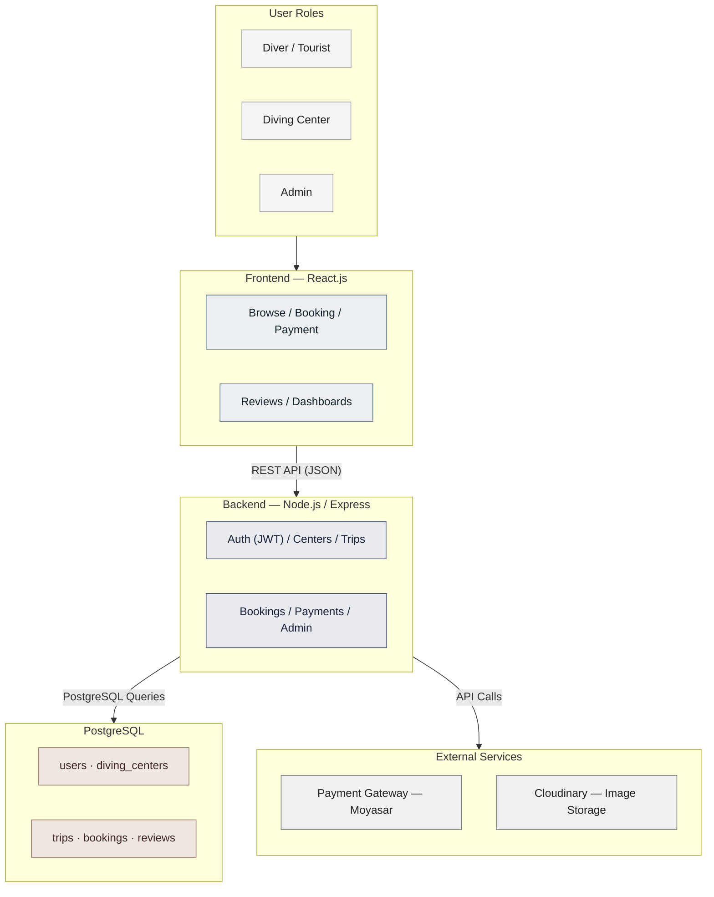

# Stage 3: Technical Documentation — Oyster 🌊

> Diving platform connecting divers and tourists with diving centers across Saudi Arabia.

---

## Table of Contents

- [Task 1: System Architecture](#task-1-system-architecture)
- [Task 5: SCM and QA Strategies](#task-5-scm-and-qa-strategies)

---

## Task 1: System Architecture

### Overview

This document defines the high-level system architecture for **Oyster**, a digital platform connecting divers and tourists with diving centers and trips across Saudi Arabia.

The architecture follows a standard **3-tier web application** model — Frontend, Backend, and Database — with integration to external third-party services.

---

### Architecture Diagram

---

### Component Descriptions

| Component | Technology | Role |
|---|---|---|
| **Frontend** | React.js | Renders the user interface. Handles all user interactions: browsing, searching, booking, and reviews. Communicates with the backend via REST API calls. |
| **Backend** | Node.js + Express | Processes all business logic. Handles authentication, data validation, and communication between the frontend and the database. Exposes RESTful API endpoints. |
| **Database** | PostgreSQL | Stores all application data: users, diving centers, trips, bookings, and reviews. Uses relational tables with foreign key constraints to enforce data integrity. |
| **Auth Layer** | JWT (JSON Web Tokens) | Manages stateless authentication. Issues tokens on login, verifies identity on protected routes. Supports 3 roles: Diver, Diving Center, Admin. |
| **Image Storage** | Cloudinary | Stores and serves images for diving centers and trips. Provides CDN delivery and automatic optimization. |
| **Payment Gateway** | Moyasar / Stripe | Processes online payments for bookings securely. Handles payment confirmation and links it to the corresponding booking record. |

---

### Data Flow

Steps describing how data moves through the system, covering the three key use cases defined in the sequence diagrams (Task 3):

#### Use Case 1: User Login

| # | Step |
|---|---|
| 1 | The user enters their email and password on the **Frontend (React.js)**. |
| 2 | The frontend sends a login request to the **Backend (Express.js)** over HTTPS. |
| 3 | The backend checks the user's credentials against **PostgreSQL**. |
| 4 | PostgreSQL returns the matching user record to the backend. |
| 5 | The backend returns an authentication response (JWT token) to the frontend. |
| 6 | The frontend displays a login success or error message to the user. |

#### Use Case 2: Browse Diving Centers by City

| # | Step |
|---|---|
| 1 | The user selects a city on the **Frontend**. |
| 2 | The frontend requests diving centers filtered by the selected city from the **Backend**. |
| 3 | The backend queries **PostgreSQL** for centers matching the selected city. |
| 4 | PostgreSQL returns the matching diving centers to the backend. |
| 5 | The backend sends the centers list to the frontend as a **JSON response**. |
| 6 | The frontend renders the list of diving centers for the user. |
| 7 | When images are involved, they are fetched directly from **Cloudinary** via CDN URLs. |

#### Use Case 3: Submit Booking Request

| # | Step |
|---|---|
| 1 | The user selects an available time slot on the **Frontend**. |
| 2 | The frontend sends a request to the **Backend** to reserve the selected slot. |
| 3 | The backend temporarily reserves the selected time slot in **PostgreSQL** (status: `Reserved`) before initiating the payment process. |
| 4 | The backend creates a payment session with the **Payment Gateway**, which is displayed to the user through the frontend. |
| 5 | The user completes the payment directly with the **Payment Gateway**, which notifies the backend of success. |
| 6 | The backend updates the booking status in PostgreSQL from `Reserved` to `Booked`. |
| 7 | The backend confirms the booking to the frontend, which displays the confirmation to the user. |

---

### Deployment Architecture

| Environment | Description |
|---|---|
| **Development** | Local machines — each developer runs the full stack locally using Node.js and PostgreSQL. |
| **Staging** | Pre-production environment used for testing before release. |
| **Production** | Deployed on a cloud platform (e.g., Render or Railway for backend, Vercel for frontend). |

---

### Technical Justifications

Every technology in this architecture was chosen based on the team's functional requirements, non-functional requirements, and project constraints.

| Technology | Decision | Justification |
|---|---|---|
| **React.js** | Frontend Framework | The team has foundational knowledge in HTML/CSS/JS. React is a natural progression that enables component-based UI development, fast rendering, and a large ecosystem of libraries. Suitable for building dynamic interfaces like center listings and booking forms. |
| **Node.js + Express** | Backend Framework | Using the same language (JavaScript) for both frontend and backend reduces context-switching and learning overhead for a 4-person student team. Express is lightweight and well-suited for building RESTful APIs quickly. |
| **PostgreSQL** | Database | A relational database was chosen over a non-relational one for Oyster's core data model. **PostgreSQL** (relational — interconnected tables) is best suited for a booking-based platform: it enforces strong relationships between users, diving centers, and bookings, and guarantees data integrity (e.g., a booking cannot exist without a valid user). Foreign key constraints prevent orphaned or invalid records. **MongoDB** (non-relational — JSON documents) was considered but not selected, as it does not enforce relational integrity by default, which is riskier for a system where bookings must always be tied to a valid user and trip. |
| **JWT** | Authentication | Stateless authentication eliminates the need for session management on the server. JWT tokens support role-based access control for 3 user types: Diver, Diving Center Admin, and Platform Admin. |
| **Payment Gateway (Moyasar)** | Payment Processing | Enables secure online payment for bookings, as defined in the MVP scope (Stage 2). Moyasar supports local Saudi payment methods (mada, Apple Pay) alongside international cards. |
| **Cloudinary** | Image Hosting | Provides a free-tier CDN for image storage and delivery. Eliminates the need to manage file storage infrastructure. Supports automatic image optimization and resizing — essential for center profile images and trip photos. |

---

### Non-Functional Requirements Addressed

| Requirement | How the Architecture Addresses It |
|---|---|
| **Performance** | React's virtual DOM minimizes re-renders. Cloudinary CDN reduces image load times. |
| **Scalability** | PostgreSQL supports indexing and read replicas for horizontal read scaling. Node.js handles concurrent requests efficiently with its non-blocking I/O model. |
| **Security** | JWT ensures only authenticated users access protected routes. HTTPS encrypts all client-server communication. Passwords are hashed using bcrypt. |
| **Maintainability** | Separation of concerns: frontend, backend, and database are fully decoupled. Each layer can be updated independently. |
| **Usability** | React enables a responsive, fast UI. A streamlined payment flow reduces booking drop-off. |

---

## Task 5: SCM and QA Strategies

### Source Control Management (SCM) Strategy

The team uses **Git** and **GitHub** to manage code changes and collaboration across the 4-person team.

#### Branching Strategy

| Branch | Purpose |
|---|---|
| `main` | Stable, production-ready code only. Updated only by the **Project Manager** after `develop` is tested and confirmed. |
| `develop` | Integration branch where each member's verified task is collected, tested, and corrected before release. |
| `<member-name>` | Each team member works individually on their own dedicated personal branch for their assigned task (e.g., `ebtihal`, `lara`). |

#### Workflow

| # | Step |
|---|---|
| 1 | Tasks are divided among the team, and each member works individually on their own dedicated branch. |
| 2 | Commits use clear, descriptive messages (e.g., `feat: add booking confirmation email`). |
| 3 | Once a member's task is verified, it is collected and integrated into the `develop` branch. |
| 4 | The combined work on `develop` is tested to confirm everything works together. |
| 5 | After testing and confirmation, the **Project Manager** merges `develop` into `main` for deployment. |

#### Code Review Checklist

- Code follows the project's naming and folder conventions
- No hardcoded credentials or sensitive data
- New endpoints are documented
- No conflicts with existing database schema

---

### Quality Assurance (QA) Strategy

#### Testing Types

| Test Type | Purpose | Scope |
|---|---|---|
| **Unit Testing** | Verify individual functions (e.g., booking price calculation, rating validation) | Backend logic |
| **Integration Testing** | Verify API endpoints interact correctly with PostgreSQL | Backend + Database |
| **Manual Testing** | Verify critical user flows (registration, browsing, booking, reviews) | Full stack |

#### Testing Tools

| Tool | Purpose |
|---|---|
| **Jest** | Unit testing for backend logic (Node.js/Express) |
| **Postman** | Manual and automated testing of REST API endpoints |
| **React Testing Library** | Component-level testing for frontend UI |

#### Deployment Pipeline

| Stage | Description |
|---|---|
| **Local Development** | Each developer runs the app locally with a local PostgreSQL instance. |
| **Staging** | Deployed from `develop` branch to test new features before release. |
| **Production** | Deployed from `main` branch — stable version available to end users. |

#### Example QA Flow

| # | Step |
|---|---|
| 1 | Developer completes their task on their individual branch. |
| 2 | Code quality is checked and unit tests are run locally (`npm test`). |
| 3 | API endpoints are manually verified in Postman. |
| 4 | Once verified, the work is merged into `develop` and deployed to staging. |
| 5 | After staging verification, the **Project Manager** merges `develop` into `main` for production release. |

---

Stage 3 — Technical Documentation · Oyster Platform · Holberton School SAU-0825 · 2026 
Author: Ebtihal Alomari

