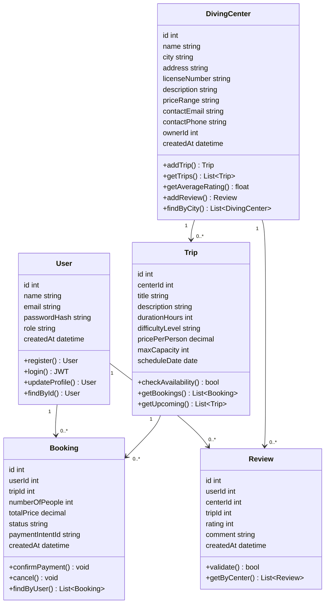
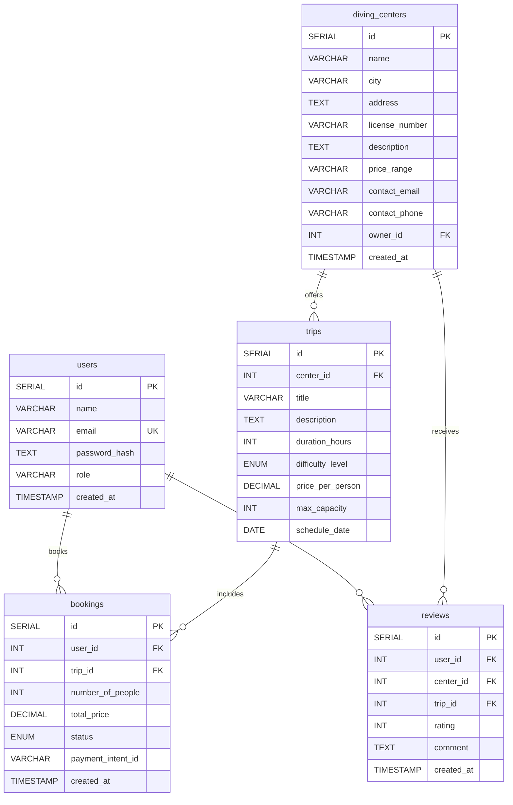

# 🗂️ Task 2 – Components, Classes, and Database Design

## Oyster: Diving Platform for Saudi Arabia

---

### 1. Class Diagram (UML)



---
# 2. Backend Class Definitions

## 2.1 User

| Attribute / Method | Description |
|----------|-------------|
| id : int | Primary key |
| name : string | Full name |
| email : string | Unique, indexed |
| passwordHash : string | bcrypt hash |
| role : string | user or admin |
| createdAt : datetime | Timestamp |
| register() | Creates new user account |
| login() | Returns JWT token |
| updateProfile() | Updates user info |
| findById() | Retrieves user by ID |

---

## 2.2 DivingCenter

| Attribute / Method | Description |
|----------|-------------|
| id : int | Primary key |
| name : string | Center name |
| city : string | Saudi city (indexed) |
| address : string | Full address (optional) |
| licenseNumber : string | Unique official license |
| description : string | Overview (optional) |
| priceRange : string | Approximate range (optional) |
| contactEmail : string | Business email (optional) |
| contactPhone : string | Phone number (optional) |
| ownerId : int | FK → users.id |
| createdAt : datetime | Timestamp |
| addTrip() | Creates a new trip |
| getTrips() | Returns all trips |
| getAverageRating() | Computes average rating |
| addReview() | Adds a review |
| findByCity() | Filters centers by city |

---

## 2.3 Trip

| Attribute / Method | Description |
|----------|-------------|
| id : int | Primary key |
| centerId : int | FK → diving_centers.id |
| title : string | Trip name |
| description : string | Details (optional) |
| durationHours : int | In hours (>0) |
| difficultyLevel : string | beginner, intermediate, advanced |
| pricePerPerson : decimal | Price in SAR |
| maxCapacity : int | Maximum divers |
| scheduleDate : date | Trip date |
| checkAvailability() | Returns true if spots left |
| getBookings() | Returns all bookings |
| getUpcoming() | Returns upcoming trips |

---

## 2.4 Booking

| Attribute / Method | Description |
|----------|-------------|
| id : int | Primary key |
| userId : int | FK → users.id |
| tripId : int | FK → trips.id |
| numberOfPeople : int | Participants (>0) |
| totalPrice : decimal | Calculated total |
| status : string | pending, confirmed, cancelled, paid |
| paymentIntentId : string | Stripe ID |
| createdAt : datetime | Booking timestamp |
| confirmPayment() | Updates status to confirmed |
| cancel() | Updates status to cancelled |
| findByUser() | Returns user's bookings |

---

## 2.5 Review

| Attribute / Method | Description |
|----------|-------------|
| id : int | Primary key |
| userId : int | FK → users.id |
| centerId : int | FK → diving_centers.id |
| tripId : int | FK → trips.id (nullable) |
| rating : int | 1–5 |
| comment : string | Review text |
| createdAt : datetime | Timestamp |
| validate() | Ensures rating is between 1–5 |
| getByCenter() | Returns reviews for a center |

---

# 3. Entity Relationship Diagram (ERD)



---

# 4. Database Schema

## 4.1 Users Table

| Column | Type | Constraints | Description |
|----------|----------|----------|----------|
| id | SERIAL | PRIMARY KEY | Unique identifier |
| name | VARCHAR(100) | NOT NULL | Full name |
| email | VARCHAR(255) | UNIQUE, NOT NULL | Login email |
| password_hash | TEXT | NOT NULL | bcrypt hash |
| role | VARCHAR(20) | DEFAULT 'user' | User role |
| created_at | TIMESTAMP | DEFAULT NOW() | Creation timestamp |

---

## 4.2 Diving Centers Table

| Column | Type | Constraints | Description |
|----------|----------|----------|----------|
| id | SERIAL | PRIMARY KEY | Unique identifier |
| name | VARCHAR(150) | NOT NULL | Center name |
| city | VARCHAR(100) | INDEX, NOT NULL | Saudi city |
| address | TEXT | NULLABLE | Full address |
| license_number | VARCHAR(50) | UNIQUE, NOT NULL | Official license |
| description | TEXT | NULLABLE | Services overview |
| price_range | VARCHAR(50) | NULLABLE | Example: 300–600 SAR |
| contact_email | VARCHAR(255) | NULLABLE | Business email |
| contact_phone | VARCHAR(20) | NULLABLE | Contact phone |
| owner_id | INT | FK → users.id | Center owner |
| created_at | TIMESTAMP | DEFAULT NOW() | Creation timestamp |

---

## 4.3 Trips Table

| Column | Type | Constraints | Description |
|----------|----------|----------|----------|
| id | SERIAL | PRIMARY KEY | Unique identifier |
| center_id | INT | FK → diving_centers.id | Parent center |
| title | VARCHAR(200) | NOT NULL | Trip name |
| description | TEXT | NULLABLE | Trip details |
| duration_hours | INT | CHECK > 0 | Duration |
| difficulty_level | ENUM | NOT NULL | Skill level |
| price_per_person | DECIMAL(10,2) | CHECK > 0 | Price |
| max_capacity | INT | CHECK > 0 | Capacity |
| schedule_date | DATE | INDEX, NOT NULL | Trip date |

---

## 4.4 Bookings Table

| Column | Type | Constraints | Description |
|----------|----------|----------|----------|
| id | SERIAL | PRIMARY KEY | Unique identifier |
| user_id | INT | FK → users.id | User |
| trip_id | INT | FK → trips.id | Trip |
| number_of_people | INT | CHECK > 0 | Participants |
| total_price | DECIMAL(10,2) | CHECK >= 0 | Total cost |
| status | ENUM | DEFAULT 'pending' | Booking status |
| payment_intent_id | VARCHAR(255) | NULLABLE | Stripe ID |
| created_at | TIMESTAMP | DEFAULT NOW() | Booking timestamp |

---

## 4.5 Reviews Table

| Column | Type | Constraints | Description |
|----------|----------|----------|----------|
| id | SERIAL | PRIMARY KEY | Unique identifier |
| user_id | INT | FK → users.id | Reviewer |
| center_id | INT | FK → diving_centers.id | Reviewed center |
| trip_id | INT | FK → trips.id | Optional trip |
| rating | INT | CHECK (1-5) | Rating |
| comment | TEXT | NULLABLE | Review text |
| created_at | TIMESTAMP | DEFAULT NOW() | Timestamp |

### Additional Constraint

```sql
UNIQUE (user_id, trip_id)
```

Prevents duplicate reviews for the same trip.

---

# 5. Frontend Component Structure

| Component | Route / Page | Responsibility |
|------------|-------------|---------------|
| Navbar | Global | Navigation and user menu |
| LoginForm | /login | User authentication |
| RegisterForm | /register | User registration |
| HomePage | / | Search and featured centers |
| CenterCard | /centers | Center summary card |
| CenterList | /centers | Filtered center listing |
| CenterDetails | /centers/:id | Center details, trips, reviews |
| TripList | Inside CenterDetails | Displays available trips |
| BookingForm | /bookings/new | Creates booking |
| PaymentModal | Global | Stripe payment popup |
| UserDashboard | /dashboard | User bookings |
| ReviewForm | /centers/:id/review | Submit reviews |
| AdminPanel | /admin | Manage centers and trips |
| ProtectedRoute | Wrapper | Authentication guard |

---

# 6. Technical Justifications

| Design Decision | Justification |
|----------------|--------------|
| PostgreSQL | Provides strong relational integrity for users, diving centers, trips, bookings, and reviews. |
| Index on `city` and `schedule_date` | Improves query performance for city-based searches and upcoming trip listings. |
| ON DELETE CASCADE | Automatically removes dependent records, such as trips when a diving center is deleted. |
| ON DELETE SET NULL | Preserves reviews when an associated trip is deleted by removing only the trip reference. |
| UNIQUE (`user_id`, `trip_id`) | Ensures that each user can submit only one review per trip. |
| CHECK Constraints | Enforces valid data such as positive numbers and ratings within the allowed range. |

---
