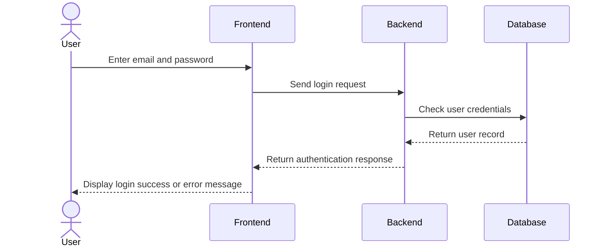
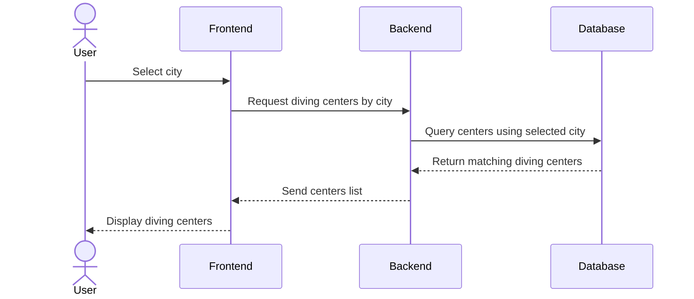
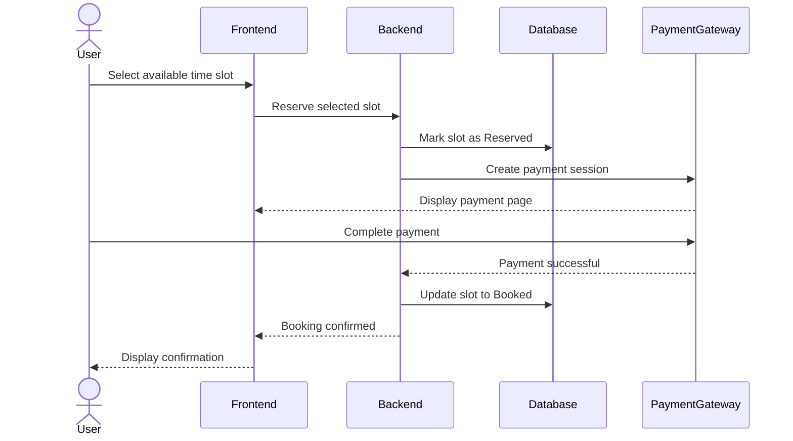

# User Stories (MoSCoW Prioritization)

## Must Have

1. **As a diver, I want to browse diving centers by city across Saudi Arabia, so that I can find nearby diving centers.**

2. **As a diver, I want to view diving center details, including descriptions, approximate pricing, and contact information, so that I can compare different centers before booking.**

3. **As a diver, I want to browse available diving trips and training courses, so that I can choose the experience that suits me.**

4. **As a user, I want to register and log in to my account, so that I can manage my bookings and profile securely.**

5. **As a diver, I want to submit booking requests through the platform, so that I can reserve a diving trip online.**

6. **As a diver, I want to receive real-time booking confirmation and view live availability, so that I know immediately whether my booking is confirmed.**

7. **As a user, I want to complete online payment securely, so that I can confirm my booking.**

8. **As an admin, I want to manage platform content through the admin dashboard, so that diving centers, trips, and information remain accurate.**

---

## Should Have

1. **As a diver, I want to rate and review diving centers and diving experiences, so that I can share my experience with other users.**

2. **As a user, I want the platform to be responsive on desktop and mobile browsers, so that I can access it from any device.**

3. **As a diving center, I want to manage my trips and booking requests through a dashboard, so that I can efficiently manage my services.**

---

## Could Have

No additional features are planned for the MVP under this category.

---

## Won't Have

1. **As a user, I want a native mobile application for iOS and Android, so that I can access the platform without a browser.**

2. **As a diver, I want AI-based personalized diving recommendations, so that I can discover trips that match my interests.**

3. **As a diver, I want the platform to integrate with PADI and SSI certification systems, so that my certifications can be verified automatically.**

4. **As a diver, I want advanced map navigation with real-time geolocation, so that I can easily navigate to diving centers.**

5. **As a user, I want live chat with diving centers, so that I can communicate before making a booking.**

6. **As a user, I want the platform to support multiple languages beyond the initial launch language, so that I can use it in my preferred language.**

# 3. Create High-Level Sequence Diagrams

## Critical Use Cases

The following sequence diagrams show the main interactions between the user, front-end, back-end, and database for key MVP features in Oyster.

---

## Use Case 1: User Login

---

## Use Case 2: Browse Diving Centers by City

---

## Use Case 3: Submit Booking Request

