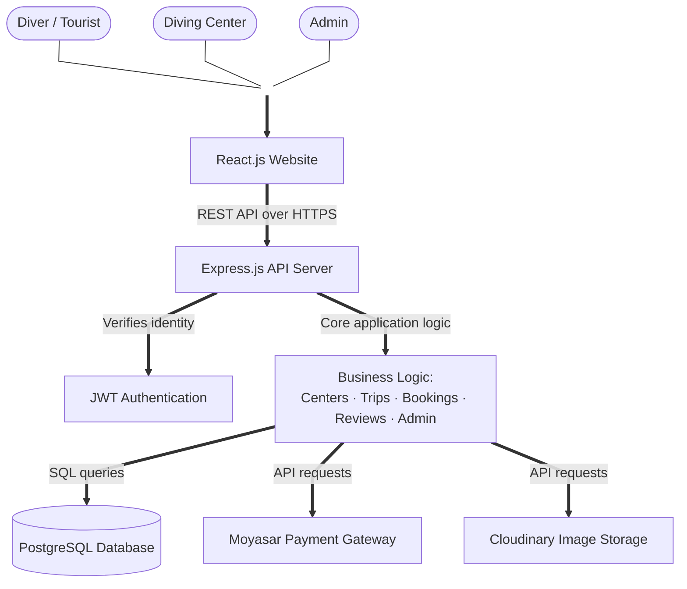
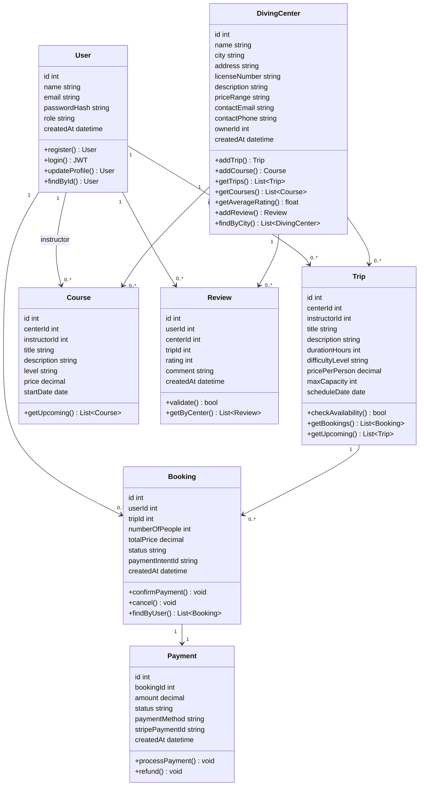
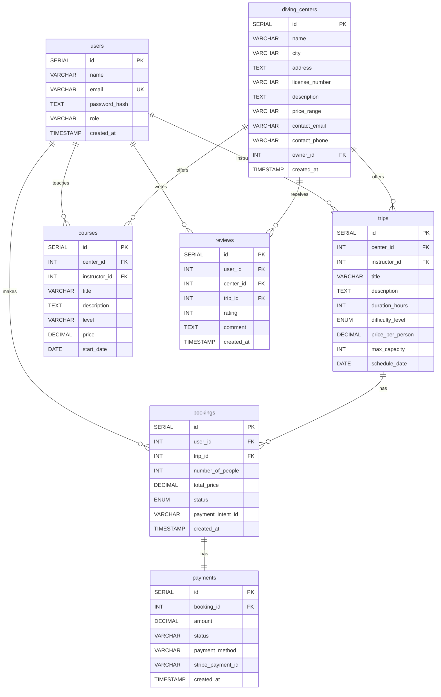
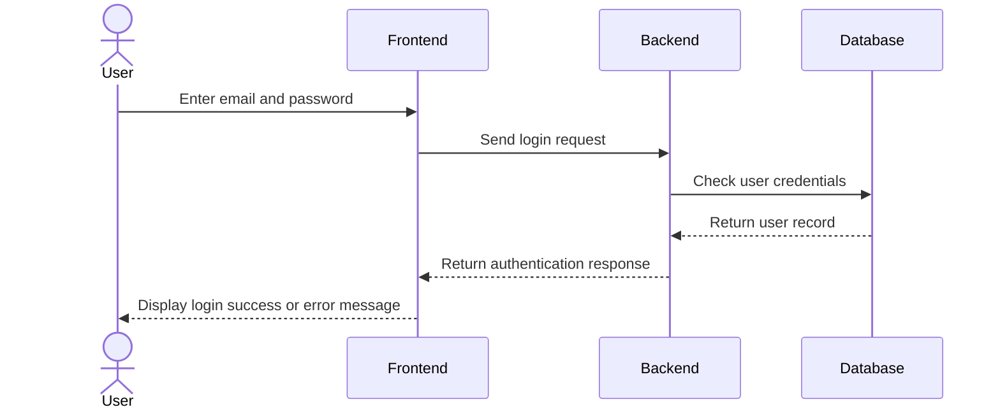
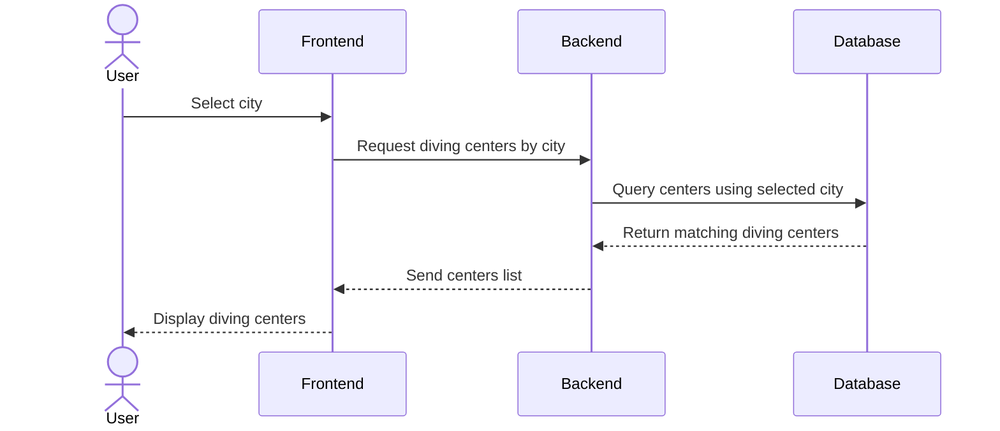
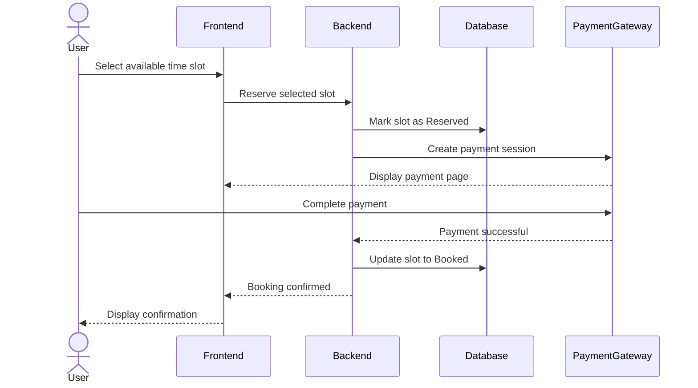

# Task 0

# User Stories (MoSCoW Prioritization)

## Must Have

1. **As a diver, I want to browse diving centers by city across Saudi Arabia, so that I can find diving centers near my preferred location.**

2. **As a diver, I want to view diving center details, including descriptions, approximate pricing, and contact information, so that I can compare different centers before booking.**

3. **As a diver, I want to browse available diving trips and training courses, so that I can choose the experience that best suits me.**

4. **As a user, I want to register and log in to my account, so that I can securely access my profile and manage my bookings.**

5. **As a diver, I want to submit booking requests through the platform, so that I can reserve a diving trip online.**

6. **As a diver, I want to receive real-time booking confirmation and view live availability, so that I know immediately whether my booking is confirmed.**

7. **As a user, I want to complete online payment securely, so that I can confirm my booking.**

8. **As an admin, I want to manage diving centers, trips, users, and platform content, so that the platform remains accurate and up to date.**

---

## Should Have

1. **As a diver, I want to rate and review diving centers and diving experiences, so that I can help other users make informed decisions.**

2. **As a user, I want the platform to be responsive on both desktop and mobile browsers, so that I can access it from any device.**

3. **As a diving center, I want to manage my trips and booking requests through a dashboard, so that I can efficiently manage my services.**

---

## Could Have

1. **As a user, I want to receive a booking confirmation email, so that I have a record of my reservation and payment details.**

2. **As a user, I want to receive SMS notifications about my booking status, so that I stay informed even when I am not using the platform.**

3. **As a user, I want to receive in-app notifications about my booking status, so that I can track updates from within the platform.**

---

## Won't Have

1. **As a user, I want a native mobile application for iOS and Android, so that I can access the platform without using a web browser.**

2. **As a diver, I want AI-based personalized diving recommendations, so that I can discover trips tailored to my interests.**

3. **As a diver, I want the platform to integrate with external certification providers (e.g., PADI and SSI), so that my certifications can be verified automatically.**

4. **As a diver, I want advanced map navigation with real-time geolocation tracking, so that I can easily navigate to diving centers.**

5. **As a user, I want live chat support with diving centers, so that I can communicate directly before making a booking.**

6. **As a user, I want the platform to support multiple languages beyond the initial launch language, so that I can use it in my preferred language.**


## Mockup Screens

The following mockups illustrate the main user journey of the Diving Trip Booking Platform, covering trip discovery, booking, payment, confirmation, user authentication, booking management, and reviews.

These screens were designed to visualize the MVP features and demonstrate the overall user experience and navigation flow across the platform.


## Task 1: System Architecture

### Overview

This document defines the high-level system architecture for **Oyster**, a digital platform connecting divers and tourists with diving centers and trips across Saudi Arabia.

The architecture follows a standard **3-tier web application** model — Frontend, Backend, and Database — with integration to external third-party services.

---

### Architecture Diagram



---

### Component Descriptions

| Component | Technology | Role |
|---|---|---|
| **Frontend** | React.js | Renders the user interface. Handles all user interactions: browsing, searching, booking, and reviews. Communicates with the backend via REST API calls. |
| **Backend** | Node.js + Express | Processes all business logic. Handles authentication, data validation, and communication between the frontend and the database. Exposes RESTful API endpoints. |
| **Database** | PostgreSQL | Stores all application data: users, diving centers, trips, bookings, and reviews. Uses relational tables with foreign key constraints to enforce data integrity. |
| **Auth Layer** | JWT (JSON Web Tokens) | Manages stateless authentication. Issues tokens on login, verifies identity on protected routes. Supports 3 roles: Diver, Diving Center, Admin. |
| **Image Storage** | Cloudinary | Stores and serves images for diving centers and trips. Provides CDN delivery and automatic optimization. |
| **Payment Gateway** | Moyasar / Stripe | Processes online payments for bookings securely. Handles payment confirmation and links it to the corresponding booking record. |

---

### Data Flow

Steps describing how data moves through the system, covering the three key use cases defined in the sequence diagrams (Task 3):

#### Use Case 1: User Login

| # | Step |
|---|---|
| 1 | The user enters their email and password on the **Frontend (React.js)**. |
| 2 | The frontend sends a login request to the **Backend (Express.js)** over HTTPS. |
| 3 | The backend checks the user's credentials against **PostgreSQL**. |
| 4 | PostgreSQL returns the matching user record to the backend. |
| 5 | The backend returns an authentication response (JWT token) to the frontend. |
| 6 | The frontend displays a login success or error message to the user. |

#### Use Case 2: Browse Diving Centers by City

| # | Step |
|---|---|
| 1 | The user selects a city on the **Frontend**. |
| 2 | The frontend requests diving centers filtered by the selected city from the **Backend**. |
| 3 | The backend queries **PostgreSQL** for centers matching the selected city. |
| 4 | PostgreSQL returns the matching diving centers to the backend. |
| 5 | The backend sends the centers list to the frontend as a **JSON response**. |
| 6 | The frontend renders the list of diving centers for the user. |
| 7 | When images are involved, they are fetched directly from **Cloudinary** via CDN URLs. |

#### Use Case 3: Submit Booking Request

| # | Step |
|---|---|
| 1 | The user selects an available time slot on the **Frontend**. |
| 2 | The frontend sends a request to the **Backend** to reserve the selected slot. |
| 3 | The backend temporarily reserves the selected time slot in **PostgreSQL** (status: `Reserved`) before initiating the payment process. |
| 4 | The backend creates a payment session with the **Payment Gateway**, which is displayed to the user through the frontend. |
| 5 | The user completes the payment directly with the **Payment Gateway**, which notifies the backend of success. |
| 6 | The backend updates the booking status in PostgreSQL from `Reserved` to `Booked`. |
| 7 | The backend confirms the booking to the frontend, which displays the confirmation to the user. |


---

### Deployment Architecture

| Environment | Description |
|---|---|
| **Development** | Local machines — each developer runs the full stack locally using Node.js and PostgreSQL. |
| **Staging** | Pre-production environment used for testing before release. |
| **Production** | Deployed on a cloud platform (e.g., Render or Railway for backend, Vercel for frontend). |

---

### Technical Justifications

Every technology in this architecture was chosen based on the team's functional requirements, non-functional requirements, and project constraints.

| Technology | Decision | Justification |
|---|---|---|
| **React.js** | Frontend Framework | The team has foundational knowledge in HTML/CSS/JS. React is a natural progression that enables component-based UI development, fast rendering, and a large ecosystem of libraries. Suitable for building dynamic interfaces like center listings and booking forms. |
| **Node.js + Express** | Backend Framework | Using the same language (JavaScript) for both frontend and backend reduces context-switching and learning overhead for a 4-person student team. Express is lightweight and well-suited for building RESTful APIs quickly. |
| **PostgreSQL** | Database | A relational database was chosen over a non-relational one for Oyster's core data model.<br>**PostgreSQL** (relational — interconnected tables) is best suited for a booking-based platform: it enforces strong relationships between users, diving centers, and bookings, and guarantees data integrity (e.g., a booking cannot exist without a valid user). Foreign key constraints prevent orphaned or invalid records.<br>**MongoDB** (non-relational — JSON documents) was considered but not selected, as it does not enforce relational integrity by default, which is riskier for a system where bookings must always be tied to a valid user and trip. |
| **JWT** | Authentication | Stateless authentication eliminates the need for session management on the server. JWT tokens support role-based access control for 3 user types: Diver, Diving Center Admin, and Platform Admin. |
| **Payment Gateway (Moyasar)** | Payment Processing | Enables secure online payment for bookings, as defined in the MVP scope (Stage 2). Moyasar supports local Saudi payment methods (mada, Apple Pay) alongside international cards. |
| **Cloudinary** | Image Hosting | Provides a free-tier CDN for image storage and delivery. Eliminates the need to manage file storage infrastructure. Supports automatic image optimization and resizing — essential for center profile images and trip photos. |

---

### Non-Functional Requirements Addressed

| Requirement | How the Architecture Addresses It |
|---|---|
| **Performance** | React's virtual DOM minimizes re-renders. Cloudinary CDN reduces image load times. |
| **Scalability** | PostgreSQL supports indexing and read replicas for horizontal read scaling. Node.js handles concurrent requests efficiently with its non-blocking I/O model. |
| **Security** | JWT ensures only authenticated users access protected routes. HTTPS encrypts all client-server communication. Passwords are hashed using bcrypt. |
| **Maintainability** | Separation of concerns: frontend, backend, and database are fully decoupled. Each layer can be updated independently. |
| **Usability** | React enables a responsive, fast UI. A streamlined payment flow reduces booking drop-off. |

---


# Task 2 – Components, Classes, and Database Design

# Oyster: Diving Platform for Saudi Arabia

---

# 1. Class Diagram (UML)



---

# 2. Backend Class Definitions

## 2.1 User
The User class represents all system actors including regular users, instructors (diving trainers), and administrators.
Access and permissions are controlled using the role attribute (user | instructor | admin).


| Attribute / Method | Description |
|----------|----------|
| id : int | Primary key |
| name : string | Full name |
| email : string | Unique, indexed |
| passwordHash : string | bcrypt hash |
| role : string | user, instructor, or admin |
| createdAt : datetime | Timestamp |
| register() | Creates new user account |
| login() | Returns JWT token |
| updateProfile() | Updates user info |
| findById() | Retrieves user by ID |

## 2.2 DivingCenter

| Attribute / Method | Description |
|----------|----------|
| id : int | Primary key |
| name : string | Center name |
| city : string | Saudi city (indexed) |
| address : string | Full address (optional) |
| licenseNumber : string | Unique official license |
| description : string | Overview (optional) |
| priceRange : string | Approximate range (optional) |
| contactEmail : string | Business email (optional) |
| contactPhone : string | Phone number (optional) |
| ownerId : int | FK → users.id |
| createdAt : datetime | Timestamp |
| addTrip() | Creates a new trip |
| addCourse() | Creates a new course |
| getTrips() | Returns all trips for this center |
| getCourses() | Returns all courses for this center |
| getAverageRating() | Computes average rating |
| addReview() | Adds a review |
| findByCity() | Filters centers by city |

## 2.3 Trip

| Attribute / Method | Description |
|----------|----------|
| id : int | Primary key |
| centerId : int | FK → diving_centers.id |
| instructorId : int | FK → users.id |
| title : string | Trip name |
| description : string | Details (optional) |
| durationHours : int | In hours (>0) |
| difficultyLevel : string | beginner, intermediate, advanced |
| pricePerPerson : decimal | Price in SAR |
| maxCapacity : int | Maximum divers |
| scheduleDate : date | Trip date |
| checkAvailability() | Returns true if spots left |
| getBookings() | Returns all bookings for this trip |
| getUpcoming() | Returns upcoming trips |

## 2.4 Course

| Attribute / Method | Description |
|----------|----------|
| id : int | Primary key |
| centerId : int | FK → diving_centers.id |
| instructorId : int | FK → users.id |
| title : string | Course name |
| description : string | Course details |
| level : string | beginner, intermediate, advanced |
| price : decimal | Price in SAR |
| startDate : date | Course start date |
| getUpcoming() | Returns upcoming courses |

## 2.5 Booking

| Attribute / Method | Description |
|----------|----------|
| id : int | Primary key |
| userId : int | FK → users.id |
| tripId : int | FK → trips.id |
| numberOfPeople : int | Participants (>0) |
| totalPrice : decimal | Calculated total |
| status : string | pending, confirmed, cancelled, paid |
| paymentIntentId : string | Stripe ID |
| createdAt : datetime | Booking timestamp |
| confirmPayment() | Updates status to confirmed |
| cancel() | Updates status to cancelled |
| findByUser() | Returns user's bookings |

## 2.6 Payment

| Attribute / Method | Description |
|----------|----------|
| id : int | Primary key |
| bookingId : int | FK → bookings.id |
| amount : decimal | Amount paid |
| status : string | pending, succeeded, failed, refunded |
| paymentMethod : string | card, stripe etc. |
| stripePaymentId : string | Stripe payment intent ID |
| createdAt : datetime | Payment timestamp |
| processPayment() | Calls Stripe to charge |
| refund() | Initiates refund via Stripe |

## 2.7 Review

| Attribute / Method | Description |
|----------|----------|
| id : int | Primary key |
| userId : int | FK → users.id |
| centerId : int | FK → diving_centers.id |
| tripId : int | FK → trips.id (nullable) |
| rating : int | 1–5 |
| comment : string | Review text |
| createdAt : datetime | Timestamp |
| validate() | Ensures rating is between 1–5 |
| getByCenter() | Returns reviews for a center |

---

# 3. Entity Relationship Diagram (ERD)



---

# 4. Database Schema

## 4.1 Users Table

| Column | Type | Constraints | Description |
|----------|----------|----------|----------|
| id | SERIAL | PRIMARY KEY | Unique identifier |
| name | VARCHAR(100) | NOT NULL | Full name |
| email | VARCHAR(255) | UNIQUE, NOT NULL | Login email |
| password_hash | TEXT | NOT NULL | bcrypt hash |
| role | VARCHAR(20) | DEFAULT 'user' | user, instructor, admin |
| created_at | TIMESTAMP | DEFAULT NOW() | Creation timestamp |

## 4.2 Diving Centers Table

| Column | Type | Constraints | Description |
|----------|----------|----------|----------|
| id | SERIAL | PRIMARY KEY | Unique identifier |
| name | VARCHAR(150) | NOT NULL | Center name |
| city | VARCHAR(100) | INDEX, NOT NULL | Saudi city |
| address | TEXT | NULLABLE | Full address |
| license_number | VARCHAR(50) | UNIQUE, NOT NULL | Official license |
| description | TEXT | NULLABLE | Services overview |
| price_range | VARCHAR(50) | NULLABLE | Example: 300–600 SAR |
| contact_email | VARCHAR(255) | NULLABLE | Business email |
| contact_phone | VARCHAR(20) | NULLABLE | Contact phone |
| owner_id | INT | FK → users.id | Center owner |
| created_at | TIMESTAMP | DEFAULT NOW() | Creation timestamp |

## 4.3 Trips Table

| Column | Type | Constraints | Description |
|----------|----------|----------|----------|
| id | SERIAL | PRIMARY KEY |
| center_id | INT | FK → diving_centers.id ON DELETE CASCADE |
| instructor_id | INT | FK → users.id ON DELETE SET NULL |
| title | VARCHAR(200) | NOT NULL |
| description | TEXT | NULLABLE |
| duration_hours | INT | CHECK > 0 |
| difficulty_level | ENUM | NOT NULL |
| price_per_person | DECIMAL(10,2) | CHECK > 0 |
| max_capacity | INT | CHECK > 0 |
| schedule_date | DATE | INDEX, NOT NULL |

## 4.4 Courses Table

| Column | Type | Constraints | Description |
|----------|----------|----------|----------|
| id | SERIAL | PRIMARY KEY |
| center_id | INT | FK → diving_centers.id ON DELETE CASCADE |
| instructor_id | INT | FK → users.id ON DELETE SET NULL |
| title | VARCHAR(200) | NOT NULL |
| description | TEXT | NULLABLE |
| level | VARCHAR(20) | NOT NULL |
| price | DECIMAL(10,2) | CHECK > 0 |
| start_date | DATE | INDEX, NOT NULL |

## 4.5 Bookings Table

| Column | Type | Constraints | Description |
|----------|----------|----------|----------|
| id | SERIAL | PRIMARY KEY |
| user_id | INT | FK → users.id ON DELETE CASCADE |
| trip_id | INT | FK → trips.id ON DELETE CASCADE |
| number_of_people | INT | CHECK > 0 |
| total_price | DECIMAL(10,2) | CHECK >= 0 |
| status | ENUM | DEFAULT 'pending' |
| payment_intent_id | VARCHAR(255) | NULLABLE |
| created_at | TIMESTAMP | DEFAULT NOW() |

## 4.6 Payments Table

| Column | Type | Constraints | Description |
|----------|----------|----------|----------|
| id | SERIAL | PRIMARY KEY |
| booking_id | INT | UNIQUE, FK → bookings.id ON DELETE CASCADE |
| amount | DECIMAL(10,2) | CHECK >= 0 |
| status | VARCHAR(20) | NOT NULL |
| payment_method | VARCHAR(50) | NOT NULL |
| stripe_payment_id | VARCHAR(255) | UNIQUE |
| created_at | TIMESTAMP | DEFAULT NOW() |

## 4.7 Reviews Table

| Column | Type | Constraints | Description |
|----------|----------|----------|----------|
| id | SERIAL | PRIMARY KEY |
| user_id | INT | FK → users.id ON DELETE CASCADE |
| center_id | INT | FK → diving_centers.id ON DELETE CASCADE |
| trip_id | INT | FK → trips.id ON DELETE SET NULL |
| rating | INT | CHECK (1–5) |
| comment | TEXT | NULLABLE |
| created_at | TIMESTAMP | DEFAULT NOW() |

### Additional Constraint

```sql
UNIQUE (user_id, trip_id)
```

---

# 5. Frontend Component Structure

| Component | Route / Page | Responsibility |
|------------|------------|------------|
| Navbar | Global | Navigation and user menu |
| LoginForm | /login | User authentication |
| RegisterForm | /register | User registration |
| HomePage | / | Search and featured centers |
| CenterCard | /centers | Center summary card |
| CenterList | /centers | Filtered center listing |
| CenterDetails | /centers/:id | Center details, trips, courses, reviews |
| TripList | Inside CenterDetails | Displays available trips |
| CourseList | Inside CenterDetails | Displays available courses |
| BookingForm | /bookings/new | Creates booking for a trip |
| PaymentModal | Global | Stripe payment popup |
| UserDashboard | /dashboard | User bookings and history |
| ReviewForm | /centers/:id/review | Submit reviews |
| AdminPanel | /admin | Manage centers, trips, courses |
| ProtectedRoute | Wrapper | Authentication guard |

---

# 6. Technical Justifications

| Design Decision | Justification |
|----------------|---------------|
| PostgreSQL | Provides strong relational integrity and supports complex queries, joins, and constraints. |
| Index on city, schedule_date, start_date | Speeds up city-based searches and upcoming trip/course listings. |
| ON DELETE CASCADE | Automatically removes dependent records and maintains consistency. |
| ON DELETE SET NULL | Preserves records when referenced entities are deleted. |
| UNIQUE (user_id, trip_id) | Prevents duplicate reviews for the same trip. |
| CHECK constraints | Enforces valid prices, capacities, durations, and ratings. |
| One-to-one Booking–Payment | Ensures each booking has exactly one payment record. |
| ENUM types | Restricts values to predefined options and reduces inconsistency. |
| Stripe IDs | Supports secure payment processing and refunds. |
| Separate Trip and Course tables | Improves clarity, maintainability, and future extensibility. |


# Task 3

# 3. Create High-Level Sequence Diagrams

## Critical Use Cases

The following sequence diagrams show the main interactions between the user, front-end, back-end, and database for key MVP features in Oyster.

---

## Use Case 1: User Login



---

## Use Case 2: Browse Diving Centers by City



---

## Use Case 3: Submit Booking Request


# Stage 3: Technical Documentation — Oyster 🌊

> Diving platform connecting divers and tourists with diving centers across Saudi Arabia.

---

## Table of Contents

- [Task 1: System Architecture](#task-1-system-architecture)
- [Task 5: SCM and QA Strategies](#task-5-scm-and-qa-strategies)

---


# Task 4 – Document External and Internal APIs

---

# 1. External APIs

The Oyster platform relies on several third-party services to provide additional functionality and reduce infrastructure complexity.

| External API | Purpose | Justification |
|--------------|---------|---------------|
| Cloudinary API | Store and deliver images | Eliminates the need for local file storage and provides CDN optimization |
| Calendly API | Schedule diving sessions and appointments | Simplifies booking and scheduling processes by allowing users to select available time slots without building a custom scheduling system |
| Moyasar Payment API | Process secure online payments | Supports local Saudi payment methods such as mada and Apple Pay |

---

# 2. Internal REST APIs

The backend exposes RESTful API endpoints that allow the frontend to communicate with the server using JSON.

---

## Authentication APIs

### Register User

| Property | Value |
|----------|--------|
| URL | `/api/auth/register` |
| Method | POST |
| Input Format | JSON |
| Output Format | JSON |

### Request

```json
{
  "name": "Solaf Alessa",
  "email": "solaf@gmail.com",
  "password": "123456"
}
```

### Response

```json
{
  "message": "User registered successfully"
}
```

---

### Login User

| Property | Value |
|----------|--------|
| URL | `/api/auth/login` |
| Method | POST |
| Input Format | JSON |
| Output Format | JSON |

### Request

```json
{
  "email": "solaf@gmail.com",
  "password": "123456"
}
```

### Response

```json
{
  "token": "JWT_TOKEN"
}
```

---

## Diving Centers APIs

| Route | Page | Responsibility |
|---------|------|---------------|
| `/dashboard` | Center Dashboard | Allows diving center owners to manage bookings, trips, courses, and center information. |

### Get All Diving Centers

| Property | Value |
|----------|--------|
| URL | `/api/centers` |
| Method | GET |
| Input Format | None |
| Output Format | JSON |

### Response

```json
[
  {
    "id": 1,
    "name": "Red Sea Diving Center",
    "city": "Jeddah"
  }
]
```

---

### Get Diving Center Details

| Property | Value |
|----------|--------|
| URL | `/api/centers/:id` |
| Method | GET |
| Input Format | URL Parameter |
| Output Format | JSON |

---

### Search Centers by City

| Property | Value |
|----------|--------|
| URL | `/api/centers?city=Jeddah` |
| Method | GET |
| Input Format | Query Parameter |
| Output Format | JSON |

---

## Trips APIs

### Get Trips for a Diving Center

| Property | Value |
|----------|--------|
| URL | `/api/trips/:centerId` |
| Method | GET |
| Input Format | URL Parameter |
| Output Format | JSON |

---

## Courses APIs

### Get Courses for a Diving Center

| Property | Value |
|----------|--------|
| URL | `/api/courses/:centerId` |
| Method | GET |
| Input Format | URL Parameter |
| Output Format | JSON |

---

## Booking APIs

### Create Booking

| Property | Value |
|----------|--------|
| URL | `/api/bookings` |
| Method | POST |
| Input Format | JSON |
| Output Format | JSON |

### Request

```json
{
  "tripId": 5,
  "numberOfPeople": 2
}
```

### Response

```json
{
  "message": "Booking created successfully"
}
```

---

### Get User Bookings

| Property | Value |
|----------|--------|
| URL | `/api/bookings/user/:id` |
| Method | GET |
| Input Format | URL Parameter |
| Output Format | JSON |

---

### Cancel Booking

| Property | Value |
|----------|--------|
| URL | `/api/bookings/:id` |
| Method | DELETE |
| Input Format | URL Parameter |
| Output Format | JSON |

---

## Payment APIs

### Process Payment

| Property | Value |
|----------|--------|
| URL | `/api/payments` |
| Method | POST |
| Input Format | JSON |
| Output Format | JSON |

### Request

```json
{
  "bookingId": 10,
  "paymentMethod": "mada"
}
```

### Response

```json
{
  "message": "Payment processed successfully"
}
```

---

## Reviews APIs

### Add Review

| Property | Value |
|----------|--------|
| URL | `/api/reviews` |
| Method | POST |
| Input Format | JSON |
| Output Format | JSON |

### Request

```json
{
  "centerId": 1,
  "rating": 5,
  "comment": "Excellent experience"
}
```

### Response

```json
{
  "message": "Review submitted successfully"
}
```

---

### Get Reviews for a Diving Center

| Property | Value |
|----------|--------|
| URL | `/api/reviews/:centerId` |
| Method | GET |
| Input Format | URL Parameter |
| Output Format | JSON |

---

## Admin APIs

| Route | Page | Responsibility |
|---------|------|---------------|
| `/admin` | Admin Dashboard | Allows administrators to manage users, diving centers, and overall platform content. |

### Add Diving Center

| Property | Value |
|----------|--------|
| URL | `/api/admin/centers` |
| Method | POST |
| Input Format | JSON |
| Output Format | JSON |

---

### Update Diving Center

| Property | Value |
|----------|--------|
| URL | `/api/admin/centers/:id` |
| Method | PUT |
| Input Format | JSON |
| Output Format | JSON |

---

### Delete Diving Center

| Property | Value |
|----------|--------|
| URL | `/api/admin/centers/:id` |
| Method | DELETE |
| Input Format | URL Parameter |
| Output Format | JSON |

---

# Technical Justifications

| Technology | Justification |
|------------|---------------|
| REST API | Simple, scalable, and widely adopted architecture |
| JSON Format | Lightweight and easy for frontend and backend communication |
| JWT Authentication | Secure stateless authentication mechanism |
| Moyasar API | Supports secure online payments and local Saudi payment methods |
| Cloudinary | Efficient cloud image hosting and optimization |
| Calendly API | Provides an easy scheduling solution and avoids building a custom booking system |

---

*Stage 3 – Technical Documentation | Oyster Platform | Solaf ALessa*

## Task 5: SCM and QA Strategies

### Source Control Management (SCM) Strategy

The team uses **Git** and **GitHub** to manage code changes and collaboration across the 4-person team.

#### Branching Strategy

| Branch | Purpose |
|---|---|
| `main` | Stable, production-ready code only. Protected branch — no direct pushes. |
| `develop` | Integration branch where completed features are merged before release. |
| `feature/<name>` | Individual branches for new features (e.g., `feature/booking-form`). |
| `fix/<name>` | Branches for bug fixes (e.g., `fix/login-validation`). |

#### Workflow

| # | Step |
|---|---|
| 1 | Each team member creates a `feature/*` branch from `develop` for their assigned task. |
| 2 | Commits use clear, descriptive messages (e.g., `feat: add booking confirmation email`). |
| 3 | A **Pull Request (PR)** is opened against `develop` once the feature is complete. |
| 4 | At least **one other team member reviews** the PR before merging. |
| 5 | After QA validation, `develop` is merged into `main` for deployment. |

#### Code Review Checklist

- Code follows the project's naming and folder conventions
- No hardcoded credentials or sensitive data
- New endpoints are documented
- No conflicts with existing database schema

---

### Quality Assurance (QA) Strategy

#### Testing Types

| Test Type | Purpose | Scope |
|---|---|---|
| **Unit Testing** | Verify individual functions (e.g., booking price calculation, rating validation) | Backend logic |
| **Integration Testing** | Verify API endpoints interact correctly with PostgreSQL | Backend + Database |
| **Manual Testing** | Verify critical user flows (registration, browsing, booking, reviews) | Full stack |

#### Testing Tools

| Tool | Purpose |
|---|---|
| **Jest** | Unit testing for backend logic (Node.js/Express) |
| **Postman** | Manual and automated testing of REST API endpoints |
| **React Testing Library** | Component-level testing for frontend UI |

#### Deployment Pipeline

| Stage | Description |
|---|---|
| **Local Development** | Each developer runs the app locally with a local PostgreSQL instance. |
| **Staging** | Deployed from `develop` branch to test new features before release. |
| **Production** | Deployed from `main` branch — stable version available to end users. |

#### Example QA Flow

| # | Step |
|---|---|
| 1 | Developer pushes feature branch and opens a PR. |
| 2 | Reviewer checks code quality and runs unit tests locally (`npm test`). |
| 3 | API endpoints are manually verified in Postman. |
| 4 | Once approved, the PR is merged into `develop` and deployed to staging. |
| 5 | After staging verification, `develop` is merged into `main` for production release. |

---

<p align="center">
<sub>Stage 3 — Technical Documentation · Oyster Platform · Holberton School SAU-0825 · 2026</sub><br>
<sub>Author: Ebtihal Alomari</sub>
</p>


