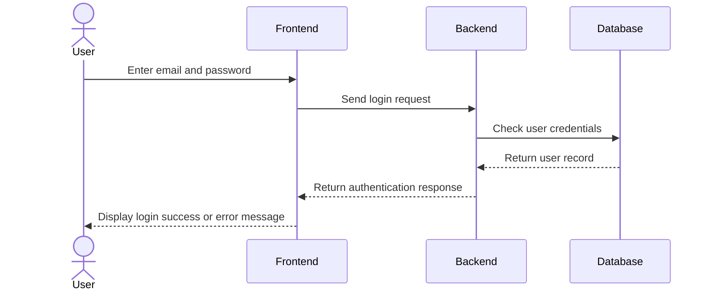
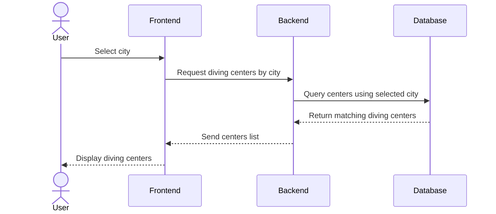
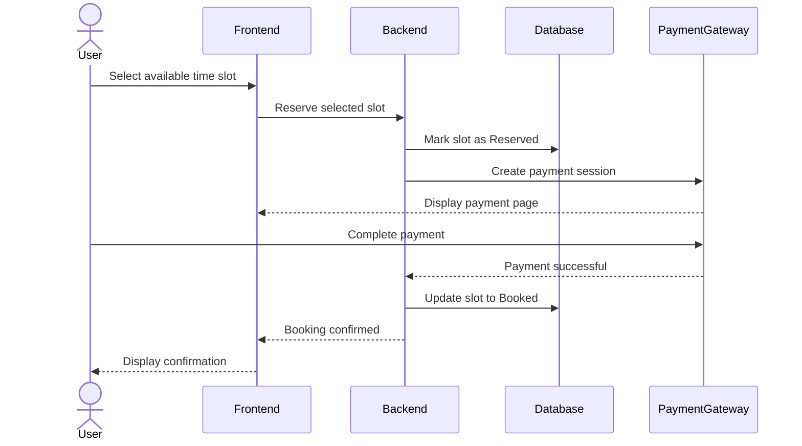

# 3. Create High-Level Sequence Diagrams

## Critical Use Cases

The following sequence diagrams show the main interactions between the user, front-end, back-end, and database for key MVP features in Oyster.

---

## Use Case 1: User Login

---

## Use Case 2: Browse Diving Centers by City

---

## Use Case 3: Submit Booking Request

