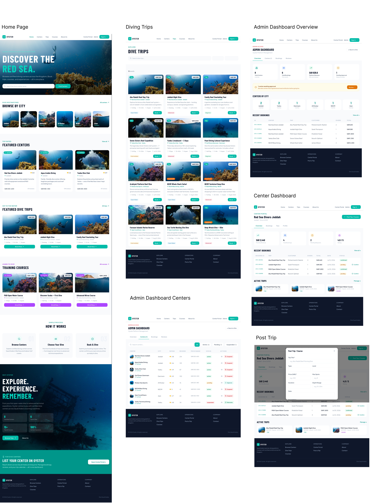
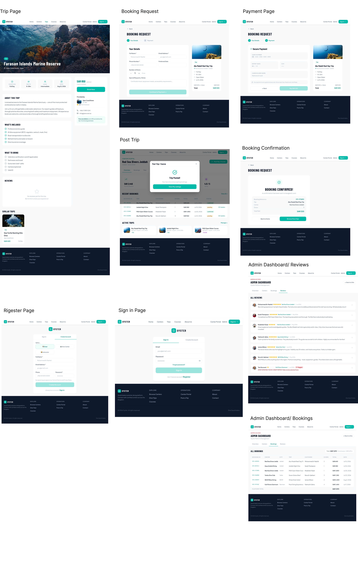
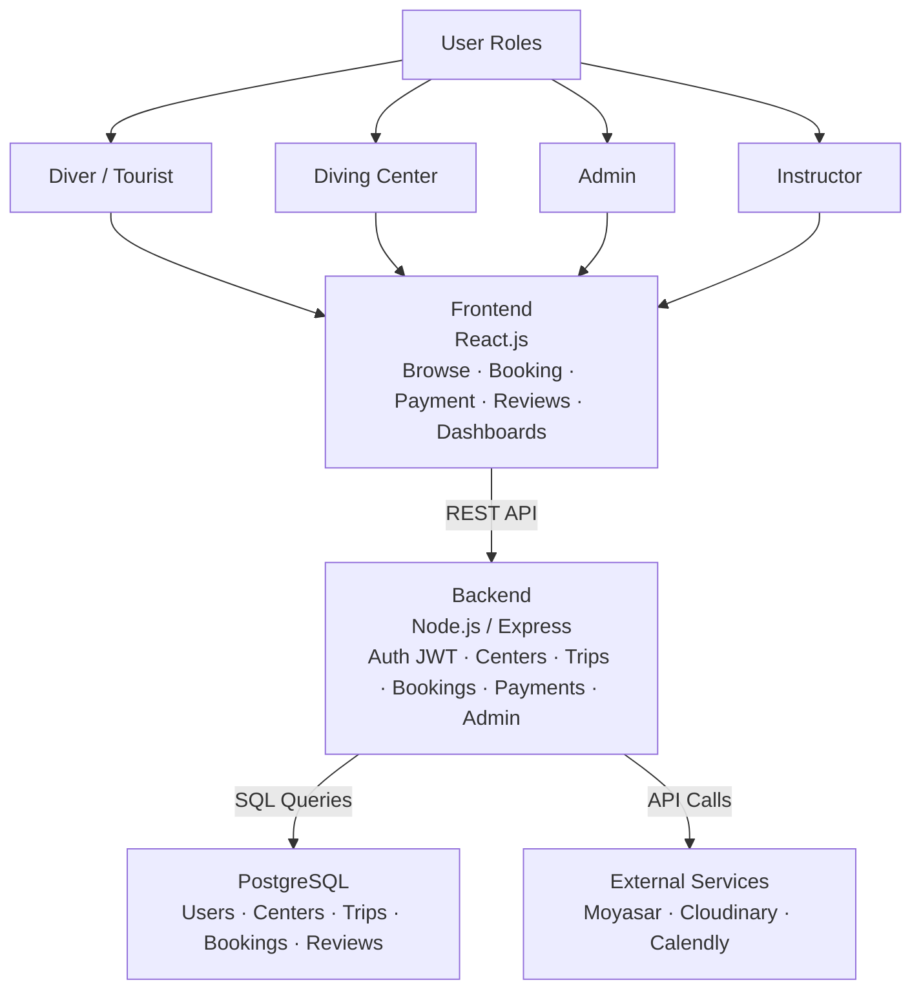
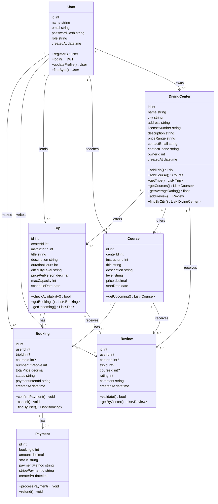
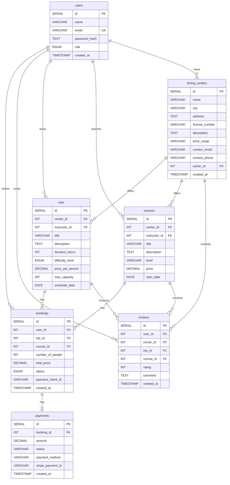
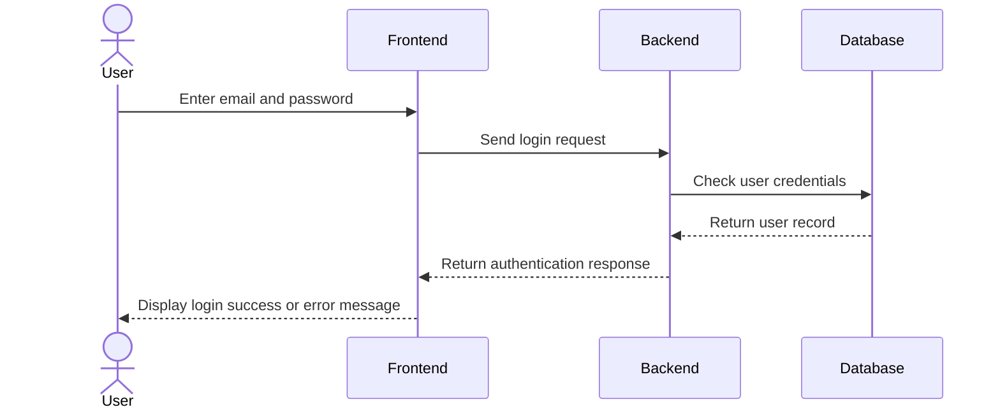
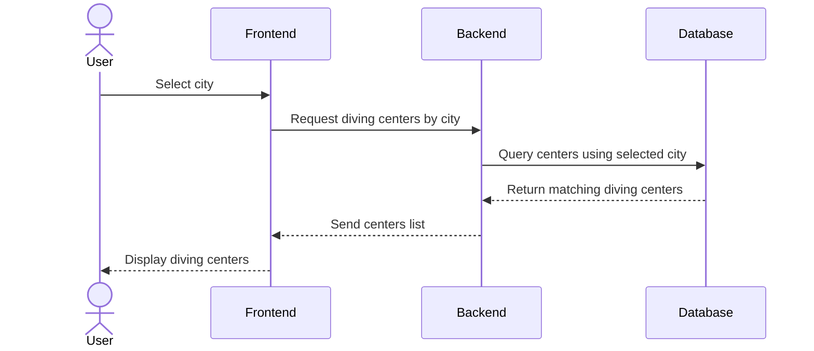
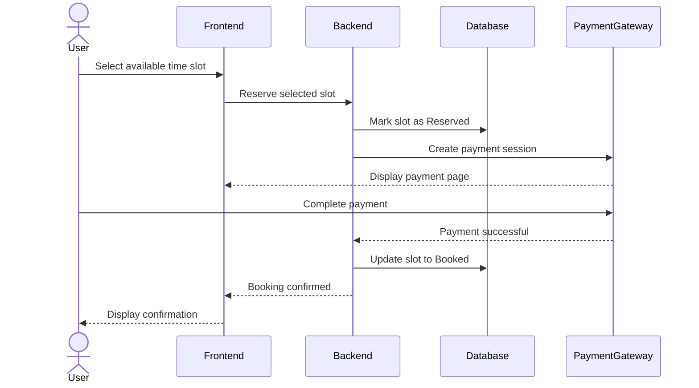

# Stage 3: Technical Documentation — Oyster

Diving platform connecting divers and tourists with diving centers across Saudi Arabia.

## Table of Contents

0. [User Stories and Mockups](#0-user-stories-and-mockups)
1. [System Architecture](#1-system-architecture)
2. [Components, Classes, and Database Design](#2-components-classes-and-database-design)
3. [Sequence Diagrams](#3-sequence-diagrams)
4. [API Specifications](#4-api-specifications)
5. [SCM and QA Plans](#5-scm-and-qa-plans)
6. [Technical Justifications](#6-technical-justifications)

---

## 0. User Stories and Mockups

### Must Have

1. As a diver, I want to browse diving centers by city across Saudi Arabia, so that I can find diving centers near my preferred location.
2. As a diver, I want to view diving center details, including descriptions, approximate pricing, and contact information, so that I can compare different centers before booking.
3. As a diver, I want to browse available diving trips and training courses, so that I can choose the experience that best suits me.
4. As a user, I want to register and log in to my account, so that I can securely access my profile and manage my bookings.
5. As a diver, I want to submit booking requests through the platform, so that I can reserve a diving trip online.
6. As a diver, I want to receive real-time booking confirmation and view live availability, so that I know immediately whether my booking is confirmed.
7. As a user, I want to complete online payment securely, so that I can confirm my booking.**
8. As an admin, I want to manage diving centers, trips, users, and platform content, so that the platform remains accurate and up to date.
9. As an admin, I want to review and approve instructor registrations, diving center registrations, and newly submitted trips and courses, so that only verified providers and approved content are visible on the platform.
10. As a diving center, I want to manage my trips and booking requests through a dashboard, so that I can efficiently manage my services.
11. As an instructor, I want to register my profile and create diving trips and training courses, so that divers can book my certified services after admin approval.


---

### Should Have

1. As a diver, I want to rate and review diving centers and diving experiences, so that I can help other users make informed decisions.
2. As a user, I want the platform to be responsive on both desktop and mobile browsers, so that I can access it from any device.

---

### Could Have

1. As a user, I want to receive a booking confirmation email, so that I have a record of my reservation and payment details.
2. As a user, I want to receive SMS notifications about my booking status, so that I stay informed even when I am not using the platform.
3. As a user, I want to receive in-app notifications about my booking status, so that I can track updates from within the platform.
4. As a user, I want a native mobile application for iOS and Android, so that I can access the platform without using a web browser.

---

### Won't Have

1. As a diver, I want AI-based personalized diving recommendations, so that I can discover trips tailored to my interests.
2. As a diver, I want the platform to integrate with external certification providers (e.g., PADI and SSI), so that my certifications can be verified automatically.
3. As a diver, I want advanced map navigation with real-time geolocation tracking, so that I can easily navigate to diving centers.
4. As a user, I want live chat support with diving centers, so that I can communicate directly before making a booking.
5. As a user, I want the platform to support multiple languages beyond the initial launch language, so that I can use it in my preferred language.

---

### Mockup Screens

The following mockups illustrate the main user journey of the Diving Trip Booking Platform, covering trip discovery, booking, payment, confirmation, user authentication, booking management, and reviews.

These screens were designed to visualize the MVP features and demonstrate the overall user experience and navigation flow across the platform.
### Figma Design

[View the Figma Design](https://www.figma.com/design/N1VPLcm86gxY3q3nVR7JBF/Untitled?node-id=0-1&t=ynCvO4NR2qTejCEd-1)




---

## 1. System Architecture

### Overview

This document defines the high-level system architecture for **Oyster**, a digital platform connecting divers and tourists with diving centers and trips across Saudi Arabia.

The architecture follows a standard **3-tier web application** model — Frontend, Backend, and Database — with integration to external third-party services.

### Architecture Diagram


### Component Descriptions

| Component | Technology | Role |
|---|---|---|
| **Frontend** | React.js | Renders the user interface. Handles all user interactions: browsing, searching, booking, and reviews. Communicates with the backend via REST API calls. |
| **Backend** | Node.js + Express | Processes all business logic. Handles authentication, data validation, and communication between the frontend and the database. Exposes RESTful API endpoints. |
| **Database** | PostgreSQL | Stores all application data: users, diving centers, trips, bookings, and reviews. Uses relational tables with foreign key constraints to enforce data integrity. |
| **Auth Layer** | JWT (JSON Web Tokens) | Manages stateless authentication. Issues tokens on login, verifies identity on protected routes. Supports 3 roles: Diver, Diving Center, Admin. |
| **Image Storage** | Cloudinary | Stores and serves images for diving centers and trips. Provides CDN delivery and automatic optimization. |
| **Payment Gateway** | Moyasar / Stripe | Processes online payments for bookings securely. Handles payment confirmation and links it to the corresponding booking record. |

### Data Flow

Steps describing how data moves through the system, covering the three key use cases defined in the sequence diagrams (Task 3):

#### Use Case 1: User Login

| # | Step |
|---|---|
| 1 | The user enters their email and password on the **Frontend (React.js)**. |
| 2 | The frontend sends a login request to the **Backend (Express.js)** over HTTPS. |
| 3 | The backend checks the user's credentials against **PostgreSQL**. |
| 4 | PostgreSQL returns the matching user record to the backend. |
| 5 | The backend returns an authentication response (JWT token) to the frontend. |
| 6 | The frontend displays a login success or error message to the user. |

#### Use Case 2: Browse Diving Centers by City

| # | Step |
|---|---|
| 1 | The user selects a city on the **Frontend**. |
| 2 | The frontend requests diving centers filtered by the selected city from the **Backend**. |
| 3 | The backend queries **PostgreSQL** for centers matching the selected city. |
| 4 | PostgreSQL returns the matching diving centers to the backend. |
| 5 | The backend sends the centers list to the frontend as a **JSON response**. |
| 6 | The frontend renders the list of diving centers for the user. |
| 7 | When images are involved, they are fetched directly from **Cloudinary** via CDN URLs. |

#### Use Case 3: Submit Booking Request

| # | Step |
|---|---|
| 1 | The user selects an available time slot on the **Frontend**. |
| 2 | The frontend sends a request to the **Backend** to reserve the selected slot. |
| 3 | The backend temporarily reserves the selected time slot in **PostgreSQL** (status: `Reserved`) before initiating the payment process. |
| 4 | The backend creates a payment session with the **Payment Gateway**, which is displayed to the user through the frontend. |
| 5 | The user completes the payment directly with the **Payment Gateway**, which notifies the backend of success. |
| 6 | The backend updates the booking status in PostgreSQL from `Reserved` to `Booked`. |
| 7 | The backend confirms the booking to the frontend, which displays the confirmation to the user. |

### Deployment Architecture

| Environment | Description |
|---|---|
| **Development** | Local machines — each developer runs the full stack locally using Node.js and PostgreSQL. |
| **Staging** | Pre-production environment used for testing before release. |
| **Production** | Deployed on a cloud platform (e.g., Render or Railway for backend, Vercel for frontend). |

### Technical Justifications

Every technology in this architecture was chosen based on the team's functional requirements, non-functional requirements, and project constraints.

| Technology | Decision | Justification |
|---|---|---|
| **React.js** | Frontend Framework | The team has foundational knowledge in HTML/CSS/JS. React is a natural progression that enables component-based UI development, fast rendering, and a large ecosystem of libraries. Suitable for building dynamic interfaces like center listings and booking forms. |
| **Node.js + Express** | Backend Framework | Using the same language (JavaScript) for both frontend and backend reduces context-switching and learning overhead for a 4-person student team. Express is lightweight and well-suited for building RESTful APIs quickly. |
| **PostgreSQL** | Database | A relational database was chosen over a non-relational one for Oyster's core data model.<br>**PostgreSQL** (relational — interconnected tables) is best suited for a booking-based platform: it enforces strong relationships between users, diving centers, and bookings, and guarantees data integrity (e.g., a booking cannot exist without a valid user). Foreign key constraints prevent orphaned or invalid records.<br>**MongoDB** (non-relational — JSON documents) was considered but not selected, as it does not enforce relational integrity by default, which is riskier for a system where bookings must always be tied to a valid user and trip. |
| **JWT** | Authentication | Stateless authentication eliminates the need for session management on the server. JWT tokens support role-based access control for 3 user types: Diver, Diving Center Admin, and Platform Admin. |
| **Payment Gateway (Moyasar)** | Payment Processing | Enables secure online payment for bookings, as defined in the MVP scope (Stage 2). Moyasar supports local Saudi payment methods (mada, Apple Pay) alongside international cards. |
| **Cloudinary** | Image Hosting | Provides a free-tier CDN for image storage and delivery. Eliminates the need to manage file storage infrastructure. Supports automatic image optimization and resizing — essential for center profile images and trip photos. |

### Non-Functional Requirements Addressed

| Requirement | How the Architecture Addresses It |
|---|---|
| **Performance** | React's virtual DOM minimizes re-renders. Cloudinary CDN reduces image load times. |
| **Scalability** | PostgreSQL supports indexing and read replicas for horizontal read scaling. Node.js handles concurrent requests efficiently with its non-blocking I/O model. |
| **Security** | JWT ensures only authenticated users access protected routes. HTTPS encrypts all client-server communication. Passwords are hashed using bcrypt. |
| **Maintainability** | Separation of concerns: frontend, backend, and database are fully decoupled. Each layer can be updated independently. |
| **Usability** | React enables a responsive, fast UI. A streamlined payment flow reduces booking drop-off. |

---


## 2. Components, Classes, and Database Design


### 1. Class Diagram (UML)



---

### 2. Backend Class Definitions

#### 2.1 User

The User class represents all system actors including regular users, instructors (diving trainers), center owners, and administrators.

Access and permissions are controlled using the role attribute:

- user
- instructor
- center_owner
- admin

| Attribute / Method | Description |
|----------|----------|
| id : int | Primary key |
| name : string | Full name |
| email : string | Unique, indexed |
| passwordHash : string | bcrypt hash |
| role : string | user, instructor, center_owner, admin |
| createdAt : datetime | Timestamp |
| register() | Creates new user account |
| login() | Returns JWT token |
| updateProfile() | Updates user info |
| findById() | Retrieves user by ID |

#### 2.2 DivingCenter

| Attribute / Method | Description |
|----------|----------|
| id : int | Primary key |
| name : string | Center name |
| city : string | Saudi city |
| address : string | Full address |
| licenseNumber : string | Official license |
| description : string | Overview |
| priceRange : string | Approximate pricing |
| contactEmail : string | Business email |
| contactPhone : string | Phone number |
| ownerId : int | FK → users.id |
| createdAt : datetime | Timestamp |
| addTrip() | Creates trip |
| addCourse() | Creates course |
| getTrips() | Returns center trips |
| getCourses() | Returns center courses |
| getAverageRating() | Average rating |
| addReview() | Adds review |
| findByCity() | Search by city |

#### 2.3 Trip

| Attribute / Method | Description |
|----------|----------|
| id : int | Primary key |
| centerId : int | FK → diving_centers.id |
| instructorId : int | FK → users.id |
| title : string | Trip name |
| description : string | Details |
| durationHours : int | Duration |
| difficultyLevel : string | Level |
| pricePerPerson : decimal | Price |
| maxCapacity : int | Capacity |
| scheduleDate : date | Date |
| checkAvailability() | Checks availability |
| getBookings() | Returns bookings |
| getUpcoming() | Upcoming trips |

#### 2.4 Course

| Attribute / Method | Description |
|----------|----------|
| id : int | Primary key |
| centerId : int | FK → diving_centers.id |
| instructorId : int | FK → users.id |
| title : string | Course title |
| description : string | Course details |
| level : string | Course level |
| price : decimal | Price |
| startDate : date | Start date |
| getUpcoming() | Upcoming courses |

#### 2.5 Booking

| Attribute / Method | Description |
|----------|----------|
| id : int | Primary key |
| userId : int | FK → users.id |
| tripId : int | FK → trips.id (nullable) |
| courseId : int | FK → courses.id (nullable) |
| numberOfPeople : int | Participants |
| totalPrice : decimal | Total price |
| status : string | pending, confirmed, cancelled |
| paymentIntentId : string | Stripe payment ID |
| createdAt : datetime | Timestamp |
| confirmPayment() | Confirm booking |
| cancel() | Cancel booking |
| findByUser() | User bookings |

#### 2.6 Payment

| Attribute / Method | Description |
|----------|----------|
| id : int | Primary key |
| bookingId : int | FK → bookings.id |
| amount : decimal | Amount |
| status : string | Payment status |
| paymentMethod : string | Payment method |
| stripePaymentId : string | Stripe transaction |
| createdAt : datetime | Timestamp |
| processPayment() | Process payment |
| refund() | Refund payment |

#### 2.7 Review

| Attribute / Method | Description |
|----------|----------|
| id : int | Primary key |
| userId : int | FK → users.id |
| centerId : int | FK → diving_centers.id |
| tripId : int | FK → trips.id (nullable) |
| courseId : int | FK → courses.id (nullable) |
| rating : int | 1–5 |
| comment : string | Review |
| createdAt : datetime | Timestamp |
| validate() | Rating validation |
| getByCenter() | Reviews by center |

### 3. Entity Relationship Diagram (ERD)



---

### 4. Database Schema

#### 4.1 Users Table

| Column | Type | Constraints | Description |
|----------|----------|----------|----------|
| id | SERIAL | PRIMARY KEY | Unique identifier |
| name | VARCHAR(100) | NOT NULL | Full name |
| email | VARCHAR(255) | UNIQUE, NOT NULL | Login email |
| password_hash | TEXT | NOT NULL | bcrypt hash |
| role | ENUM | DEFAULT 'user' | user, instructor, center_owner, admin |
| created_at | TIMESTAMP | DEFAULT NOW() | Creation timestamp |

---

#### 4.2 Diving Centers Table

| Column | Type | Constraints | Description |
|----------|----------|----------|----------|
| id | SERIAL | PRIMARY KEY | Unique identifier |
| name | VARCHAR(150) | NOT NULL | Center name |
| city | VARCHAR(100) | INDEX, NOT NULL | Saudi city |
| address | TEXT | NULLABLE | Full address |
| license_number | VARCHAR(50) | UNIQUE, NOT NULL | Official license |
| description | TEXT | NULLABLE | Services overview |
| price_range | VARCHAR(50) | NULLABLE | Example: 300–600 SAR |
| contact_email | VARCHAR(255) | NULLABLE | Business email |
| contact_phone | VARCHAR(20) | NULLABLE | Contact phone |
| owner_id | INT | FK → users.id ON DELETE CASCADE | Center owner |
| created_at | TIMESTAMP | DEFAULT NOW() | Creation timestamp |

---

#### 4.3 Trips Table

| Column | Type | Constraints | Description |
|----------|----------|----------|----------|
| id | SERIAL | PRIMARY KEY | Unique identifier |
| center_id | INT | FK → diving_centers.id ON DELETE CASCADE | Parent center |
| instructor_id | INT | FK → users.id ON DELETE SET NULL | Assigned instructor |
| title | VARCHAR(200) | NOT NULL | Trip name |
| description | TEXT | NULLABLE | Trip details |
| duration_hours | INT | CHECK > 0 | Duration |
| difficulty_level | ENUM | NOT NULL | Skill level |
| price_per_person | DECIMAL(10,2) | CHECK > 0 | Price |
| max_capacity | INT | CHECK > 0 | Capacity |
| schedule_date | DATE | INDEX, NOT NULL | Trip date |

---

#### 4.4 Courses Table

| Column | Type | Constraints | Description |
|----------|----------|----------|----------|
| id | SERIAL | PRIMARY KEY | Unique identifier |
| center_id | INT | FK → diving_centers.id ON DELETE CASCADE | Parent center |
| instructor_id | INT | FK → users.id ON DELETE SET NULL | Assigned instructor |
| title | VARCHAR(200) | NOT NULL | Course title |
| description | TEXT | NULLABLE | Course details |
| level | VARCHAR(20) | NOT NULL | Course level |
| price | DECIMAL(10,2) | CHECK > 0 | Course fee |
| start_date | DATE | INDEX, NOT NULL | Course start date |

---

#### 4.5 Bookings Table

| Column | Type | Constraints | Description |
|----------|----------|----------|----------|
| id | SERIAL | PRIMARY KEY | Unique identifier |
| user_id | INT | FK → users.id ON DELETE CASCADE | Customer |
| trip_id | INT | FK → trips.id ON DELETE CASCADE, NULLABLE | Booked trip |
| course_id | INT | FK → courses.id ON DELETE CASCADE, NULLABLE | Booked course |
| number_of_people | INT | CHECK > 0 | Participants |
| total_price | DECIMAL(10,2) | CHECK >= 0 | Total cost |
| status | ENUM | DEFAULT 'pending' | Booking status |
| payment_intent_id | VARCHAR(255) | NULLABLE | Stripe ID |
| created_at | TIMESTAMP | DEFAULT NOW() | Booking timestamp |

### Additional Constraint

```sql
CHECK (
    (trip_id IS NOT NULL AND course_id IS NULL)
    OR
    (trip_id IS NULL AND course_id IS NOT NULL)
)
```

Ensures a booking belongs to either a trip or a course, but not both.

---

#### 4.6 Payments Table

| Column | Type | Constraints | Description |
|----------|----------|----------|----------|
| id | SERIAL | PRIMARY KEY | Unique identifier |
| booking_id | INT | UNIQUE, FK → bookings.id ON DELETE CASCADE | Related booking |
| amount | DECIMAL(10,2) | CHECK >= 0 | Amount paid |
| status | VARCHAR(20) | NOT NULL | pending, succeeded, failed, refunded |
| payment_method | VARCHAR(50) | NOT NULL | Payment method |
| stripe_payment_id | VARCHAR(255) | UNIQUE | Stripe transaction ID |
| created_at | TIMESTAMP | DEFAULT NOW() | Payment timestamp |

---

#### 4.7 Reviews Table

| Column | Type | Constraints | Description |
|----------|----------|----------|----------|
| id | SERIAL | PRIMARY KEY | Unique identifier |
| user_id | INT | FK → users.id ON DELETE CASCADE | Reviewer |
| center_id | INT | FK → diving_centers.id ON DELETE CASCADE | Reviewed center |
| trip_id | INT | FK → trips.id ON DELETE SET NULL, NULLABLE | Related trip |
| course_id | INT | FK → courses.id ON DELETE SET NULL, NULLABLE | Related course |
| rating | INT | CHECK (rating BETWEEN 1 AND 5) | Rating |
| comment | TEXT | NULLABLE | Review text |
| created_at | TIMESTAMP | DEFAULT NOW() | Timestamp |

### Additional Constraints

```sql
UNIQUE (user_id, trip_id)
```

Prevents duplicate reviews for the same trip.

```sql
UNIQUE (user_id, course_id)
```

Prevents duplicate reviews for the same course.

---
### 5. Frontend Component Structure

| Component | Route / Page | Responsibility |
|------------|------------|------------|
| Navbar | Global | Navigation and user menu |
| HomePage | / | Hero section, featured trips, statistics, and platform overview |
| CenterList | /centers | Browse diving centers with city and rating filters |
| CenterDetails | /centers/:id | Center details, gallery, trips, courses, and reviews |
| TripsList | /trips | Browse all diving trips with filters and search |
| TripDetail | /trips/:id | Trip details, reviews, availability, and similar trips |
| CoursesList | /courses | Browse all diving courses with filters |
| AboutPage | /about | Platform information, mission, and team |
| BookingForm | /booking/:tripId | Create a booking for a selected trip |
| AuthPage | /auth | User login and registration |
| PaymentModal | Global | Stripe payment processing popup |
| ReviewForm | /centers/:id/review | Submit reviews for centers, trips, or courses |
| UserDashboard | /dashboard | User bookings, payments, and history |
| CenterDashboard | /dashboard | Diving center management dashboard |
| AdminPanel | /admin | Manage users, centers, trips, courses, and reviews |
| ProtectedRoute | Wrapper | Authentication and authorization guard |

---

### 6. Technical Justifications

| Design Decision | Justification |
|----------------|---------------|
| PostgreSQL | Provides strong relational integrity and supports complex queries, joins, and constraints |
| ENUM role | Restricts user roles to predefined values |
| Index on city, schedule_date, start_date | Speeds up searches and upcoming listings |
| ON DELETE CASCADE | Automatically removes dependent records |
| ON DELETE SET NULL | Preserves reviews when trips/courses are deleted |
| CHECK Booking Constraint | Ensures booking belongs to either a trip or a course |
| UNIQUE (user_id, trip_id) | Prevents duplicate trip reviews |
| UNIQUE (user_id, course_id) | Prevents duplicate course reviews |
| One-to-zero-or-one Booking–Payment | Booking may exist before payment |
| Stripe IDs | Supports secure payment processing and refunds |
| Separate Trip and Course tables | Improves scalability and maintainability |
| Instructor Assignment | Allows instructors to manage trips and courses |
| Owner Relationship | Links diving centers to their owners clearly |

---

## 3. Sequence Diagrams

### Critical Use Cases

The following sequence diagrams show the main interactions between the user, front-end, back-end, and database for key MVP features in Oyster.

### Use Case 1: User Login



### Use Case 2: Browse Diving Centers by City



### Use Case 3: Submit Booking Request



---

## 4. API Specifications

### 1. External APIs

The Oyster platform relies on several third-party services to provide additional functionality and reduce infrastructure complexity.

| External API | Purpose | Justification |
|--------------|---------|---------------|
| Cloudinary API | Store and deliver images | Eliminates the need for local file storage and provides CDN optimization |
| Moyasar Payment API | Process secure online payments | Supports local Saudi payment methods such as mada and Apple Pay |
| Calendly API | Schedule diving sessions and appointments | Simplifies booking and scheduling processes by allowing users to select available time slots without building a custom scheduling system |

### 2. Internal REST APIs

The backend exposes RESTful API endpoints that allow the frontend to communicate with the server using JSON.

---

### Home APIs

##### Get Home Data

| Property | Value |
|----------|--------|
| URL | `/api/home` |
| Method | GET |
| Input Format | None |
| Output Format | JSON |

###### Request

```json
{}
```

###### Response

```json
{
  "featuredTrips": [],
  "featuredCenters": [],
  "statistics": {
    "centers": 25,
    "trips": 80,
    "courses": 18
  }
}
```

---

### Authentication APIs

##### Register User

| Property | Value |
|----------|--------|
| URL | `/api/auth/register` |
| Method | POST |
| Input Format | JSON |
| Output Format | JSON |

###### Request

```json
{
  "name": "Solaf Alessa",
  "email": "solaf@gmail.com",
  "password": "123456"
}
```

###### Response

```json
{
  "id": 15,
  "message": "User registered successfully"
}
```

##### Login User

| Property | Value |
|----------|--------|
| URL | `/api/auth/login` |
| Method | POST |
| Input Format | JSON |
| Output Format | JSON |

###### Request

```json
{
  "email": "solaf@gmail.com",
  "password": "123456"
}
```

###### Response

```json

{
  "token": "JWT_TOKEN",
  "user": {
    "id": 1,
    "role": "customer"
  }
}
```

---

### Diving Centers APIs

| Route | Page | Responsibility |
|---------|------|---------------|
| `/dashboard` | Center Dashboard | Allows diving center owners to manage bookings, trips, courses, and center information. |

##### Get Center Dashboard Data

| Property | Value |
|----------|--------|
| URL | `/api/dashboard/center` |
| Method | GET |
| Input Format | None |
| Output Format | JSON |

###### Request

```json
{}
```

###### Response

```json
{
  "totalBookings": 35,
  "activeTrips": 12,
  "activeCourses": 6
}
```

##### Get All Diving Centers

| Property | Value |
|----------|--------|
| URL | `/api/centers` |
| Method | GET |
| Input Format | None |
| Output Format | JSON |

###### Request

```json
{}
```

###### Response

```json
[
  {
    "id": 1,
    "name": "Red Sea Diving Center",
    "city": "Jeddah"
  }
]
```

##### Get Diving Center Details

| Property | Value |
|----------|--------|
| URL | `/api/centers/:id` |
| Method | GET |
| Input Format | URL Parameter |
| Output Format | JSON |

###### Request

```json
{}
```

###### Response

```json
{
  "id": 1,
  "name": "Red Sea Diving Center",
  "city": "Jeddah",
  "description": "Professional diving center",
  "priceRange": "300-600 SAR",
  "contactPhone": "+966500000000"
}
```

##### Search Centers by City

| Property | Value |
|----------|--------|
| URL | `/api/centers?city=Jeddah` |
| Method | GET |
| Input Format | Query Parameter |
| Output Format | JSON |

###### Request

```json
{}
```

###### Response

```json
[
  {
    "id": 1,
    "name": "Red Sea Diving Center",
    "city": "Jeddah"
  }
]
```

---

### Trips APIs

##### Get All Trips

| Property | Value |
|----------|--------|
| URL | `/api/trips` |
| Method | GET |
| Input Format | None |
| Output Format | JSON |

###### Request

```json
{}
```

###### Response

```json
[
  {
    "id": 5,
    "title": "Coral Reef Dive",
    "city": "Jeddah",
    "price": 350
  }
]
```

##### Get Trip Details

| Property | Value |
|----------|--------|
| URL | `/api/trips/:id` |
| Method | GET |
| Input Format | URL Parameter |
| Output Format | JSON |

###### Request

```json
{}
```

###### Response

```json
{
  "id": 5,
  "title": "Coral Reef Dive",
  "description": "Explore coral reefs",
  "city": "Jeddah",
  "price": 350,
  "difficulty": "Beginner"
}
```

##### Get Trips for a Diving Center

| Property | Value |
|----------|--------|
| URL | `/api/centers/:centerId/trips` |
| Method | GET |
| Input Format | URL Parameter |
| Output Format | JSON |

###### Request

```json
{}
```

###### Response

```json
[
  {
    "id": 5,
    "title": "Coral Reef Dive"
  }
]
```

---

### Courses APIs

##### Get All Courses

| Property | Value |
|----------|--------|
| URL | `/api/courses` |
| Method | GET |
| Input Format | None |
| Output Format | JSON |

###### Request

```json
{}
```

###### Response

```json
[
  {
    "id": 2,
    "title": "Open Water Diver",
    "level": "Beginner",
    "price": 1200
  }
]
```

##### Get Courses for a Diving Center

| Property | Value |
|----------|--------|
| URL | `/api/centers/:centerId/courses` |
| Method | GET |
| Input Format | URL Parameter |
| Output Format | JSON |

###### Request

```json
{}
```

###### Response

```json
[
  {
    "id": 2,
    "title": "Open Water Diver"
  }
]
```

---

### About APIs

##### Get About Information

| Property | Value |
|----------|--------|
| URL | `/api/about` |
| Method | GET |
| Input Format | None |
| Output Format | JSON |

###### Request

```json
{}
```

###### Response

```json
{
  "mission": "Promote marine tourism in Saudi Arabia",
  "vision": "Support Vision 2030"
}
```

---

### Booking APIs

#### Create Trip Booking

| Property | Value |
|----------|--------|
| URL | `/api/trips/:tripId/bookings` |
| Method | POST |
| Input Format | JSON |
| Output Format | JSON |

#### Request

```json
{
  "numberOfPeople": 2
}
```

#### Response

```json
{
  "message": "Trip booking created successfully"
}
```

#### Create Course Booking

| Property | Value |
|----------|--------|
| URL | `/api/courses/:courseId/bookings` |
| Method | POST |
| Input Format | JSON |
| Output Format | JSON |

#### Request

```json
{
  "numberOfPeople": 2
}
```
#### Response

```json
{
  "message": "Course booking created successfully"
}
```
#### Get Booking Details

| Property | Value |
|----------|--------|
| URL | `/api/bookings/:bookingId` |
| Method | GET |
| Input Format | URL Parameter |
| Output Format | JSON |

#### Request

```json
{}
```

#### Response

```json
{
  "bookingId": 15,
  "tripId": 5,
  "numberOfPeople": 2,
  "status": "Confirmed"
}
```

#### Get User Bookings

| Property | Value |
|----------|--------|
| URL | `/api/bookings/user/:id` |
| Method | GET |
| Input Format | URL Parameter |
| Output Format | JSON |

#### Request

```json
{}
```

#### Response

```json
[
  {
    "bookingId": 15,
    "tripId": 5,
    "status": "Confirmed"
  }
]
```

#### Cancel Booking

| Property | Value |
|----------|--------|
| URL | `/api/bookings/:bookingId` |
| Method | DELETE |
| Input Format | URL Parameter |
| Output Format | JSON |

#### Request

```json
{}
```

#### Response

```json
{
  "message": "Booking cancelled successfully"
}
```

---

### Payment APIs

#### Process Payment

| Property | Value |
|----------|--------|
| URL | `/api/bookings/:bookingId/payment` |
| Method | POST |
| Input Format | JSON |
| Output Format | JSON |

#### Request

```json
{
  "bookingId": 10,
  "paymentMethod": "mada"
}
```

#### Response

```json
{
  "message": "Payment processed successfully"
}
```

#### Failed Response

```json
{
  "message": "Payment failed"
}
```

---

### Reviews APIs

##### Diving Center Review

| Property | Value |
|----------|--------|
| URL | `/api/centers/:centerId/reviews` |
| Method | POST |
| Input Format | JSON |
| Output Format | JSON |

###### Request

```json
{
  "rating": 5,
  "comment": "Excellent experience"
}
```

###### Response

```json
{
  "message": "Review submitted successfully"
}
```

##### Get Reviews for a Diving Center

| Property | Value |
|----------|--------|
| URL | `/api/centers/:centerId/reviews` |
| Method | GET |
| Input Format | URL Parameter |
| Output Format | JSON |

###### Request

```json
{}
```

###### Response

```json
[
  {
    "user": "Ahmed",
    "rating": 5,
    "comment": "Excellent experience"
  }
]
```

### Instructor Reviews APIs

##### Add Instructor Review

| Property | Value |
|----------|--------|
| URL | `/api/instructors/:instructorId/reviews` |
| Method | POST |
| Input Format | JSON |
| Output Format | JSON |

###### Request

```json
{
  "rating": 5,
  "comment": "Excellent instructor"
}
```

###### Response

```json
{
  "message": "Review submitted successfully"
}
```

##### Get Reviews for an Instructor

| Property | Value |
|----------|--------|
| URL | `/api/instructors/:instructorId/reviews` |
| Method | GET |
| Input Format | URL Parameter |
| Output Format | JSON |

###### Request

```json
{}
```

###### Response

```json
[
  {
    "user": "Ahmed",
    "rating": 5,
    "comment": "Excellent instructor"
  }
]
```
---

### Admin APIs

| Route | Page | Responsibility |
|---------|------|---------------|
| `/admin` | Admin Dashboard | Allows administrators to manage users, diving centers, and overall platform content |

##### Get Admin Dashboard Data

| Property | Value |
|----------|--------|
| URL | `/api/admin/dashboard` |
| Method | GET |
| Input Format | None |
| Output Format | JSON |

###### Request

```json
{}
```

###### Response

```json
{
  "totalUsers": 150,
  "pendingCenters": 5,
  "pendingInstructors": 3
}
```

##### Add Diving Center

| Property | Value |
|----------|--------|
| URL | `/api/admin/centers` |
| Method | POST |
| Input Format | JSON |
| Output Format | JSON |

###### Request

```json
{
  "name": "Red Sea Diving Center",
  "city": "Jeddah",
  "description": "Professional diving center offering diving trips and training courses.",
  "contactPhone": "+966500000000",
  "priceRange": "300-600 SAR"
}
```

###### Response

```json
{
  "message": "Diving center added successfully"
}
```

##### Update Diving Center

| Property | Value |
|----------|--------|
| URL | `/api/admin/centers/:id` |
| Method | PUT |
| Input Format | JSON |
| Output Format | JSON |

###### Request

```json
{
  "name": "Red Sea Diving Center",
  "city": "Jeddah",
  "description": "Updated diving center information.",
  "contactPhone": "+966500000000",
  "priceRange": "350-650 SAR"
}
```

###### Response

```json
{
  "message": "Diving center updated successfully"
}
```

##### Delete Diving Center

| Property | Value |
|----------|--------|
| URL | `/api/admin/centers/:id` |
| Method | DELETE |
| Input Format | URL Parameter |
| Output Format | JSON |

###### Request

```json
{}
```

###### Response

```json
{
  "message": "Diving center deleted successfully"
}
```

---

### Approve Instructor Registration

| Property      | Value                                 |
| ------------- | ------------------------------------- |
| URL           | `/api/admin/instructors/:id/approve` |
| Method        | PATCH                                 |
| Input Format  | None                                  |
| Output Format | JSON                                  |

###### Request

```json
{}
```

###### Response

```json
{
  "message": "Instructor approved successfully.",
  "status": "approved"
}
```

### Approve Diving Center Application

| Property      | Value                                    |
| ------------- | ---------------------------------------- |
| URL           | `/api/admin/centers/:id/approve` |
| Method        | PATCH                                    |
| Input Format  | None                                     |
| Output Format | JSON                                     |

###### Request

```json
{}
```

###### Response

```json
{
  "message": "Diving center application approved successfully.",
  "status": "approved"
}
```

### Reject Diving Center Application

| Property      | Value                                   |
| ------------- | --------------------------------------- |
| URL           | `/api/admin/centers/:id/reject` |
| Method        | PATCH                                   |
| Input Format  | JSON                                    |
| Output Format | JSON                                    |

###### Request

```json
{
  "reason": "Business license is invalid."
}
```

###### Response

```json
{
  "message": "Diving center application rejected successfully.",
  "status": "rejected"
}
```

### Reject Instructor Registration

| Property      | Value                                |
| ------------- | ------------------------------------ |
| URL           | `/api/admin/instructors/:id/reject` |
| Method        | PATCH                                |
| Input Format  | JSON                                 |
| Output Format | JSON                                 |

###### Request

```json
{
  "reason": "Certification documents could not be verified."
}
```

###### Response

```json
{
  "message": "Instructor registration rejected successfully.",
  "status": "rejected"
}
```

---

### Instructor APIs

##### Register Instructor

| Property      | Value                       |
| ------------- | --------------------------- |
| URL           | `/api/instructors/register` |
| Method        | POST                        |
| Input Format  | JSON                        |
| Output Format | JSON                        |

###### Request

```json
{
  "fullName": "Ahmed Alqahtani",
  "email": "ahmed@example.com",
  "password": "123456",
  "phone": "+966500000000",
  "certification": "PADI Open Water Scuba Instructor",
  "certificationNumber": "PADI-123456"
}
```

###### Response

```json
{
  "id": 8,
  "message": "Instructor registration submitted successfully. Your account is pending admin approval.",
  "status": "pending"
}
```
##### Create Trip

| Property      | Value                    |
| ------------- | ------------------------ |
| URL           | `/api/instructors/trips` |
| Method        | POST                     |
| Input Format  | JSON                     |
| Output Format | JSON                     |

###### Request

```json
{
  "title": "Coral Reef Dive",
  "location": "Jeddah",
  "date": "2026-08-15",
  "maxParticipants": 8,
  "price": 350
}
```

###### Response

```json
{
  "id": 12,
  "message": "Trip created successfully and submitted for admin approval.",
  "status": "pending"
}
```

##### Create Course

| Property      | Value                      |
| ------------- | -------------------------- |
| URL           | `/api/instructors/courses` |
| Method        | POST                       |
| Input Format  | JSON                       |
| Output Format | JSON                       |

###### Request

```json
{
  "title": "Open Water Diver",
  "level": "Beginner",
  "durationDays": 4,
  "price": 1200,
  "maxParticipants": 6
}
```

###### Response

```json
{
  "id": 7,
  "message": "Course created successfully and submitted for admin approval.",
  "status": "pending"
}
```
##### Delete Trip

| Property      | Value                         |
| ------------- | ----------------------------- |
| URL           | `/api/instructors/trips/:id` |
| Method        | DELETE                        |
| Input Format  | None                          |
| Output Format | JSON                          |

###### Request

```json
{}
```

###### Response

```json
{
  "message": "Trip deleted successfully."
}
```

##### Delete Course

| Property      | Value                           |
| ------------- | ------------------------------- |
| URL           | `/api/instructors/courses/:id` |
| Method        | DELETE                          |
| Input Format  | None                            |
| Output Format | JSON                            |

###### Request

```json
{}
```

###### Response

```json
{
  "message": "Course deleted successfully."
}
```

##### Update Trip

| Property      | Value                         |
| ------------- | ----------------------------- |
| URL           | `/api/instructors/trips/:id` |
| Method        | PUT                           |
| Input Format  | JSON                          |
| Output Format | JSON                          |

###### Request

```json
{
  "title": "Coral Reef Dive",
  "location": "Jeddah",
  "date": "2026-08-20",
  "maxParticipants": 10,
  "price": 400
}
```

###### Response

```json
{
  "message": "Trip updated successfully and submitted for admin approval.",
  "status": "pending"
}
```

##### Update Course

| Property      | Value                           |
| ------------- | ------------------------------- |
| URL           | `/api/instructors/courses/:id` |
| Method        | PUT                             |
| Input Format  | JSON                            |
| Output Format | JSON                            |

###### Request

```json
{
  "title": "Open Water Diver",
  "level": "Beginner",
  "durationDays": 5,
  "price": 1300,
  "maxParticipants": 8
}
```

###### Response

```json
{
  "message": "Course updated successfully and submitted for admin approval.",
  "status": "pending"
}
```

---

## 5. SCM and QA Plans

### Source Control Management (SCM) Strategy

The team uses **Git** and **GitHub** to manage code changes and collaboration across the 4-person team.

#### Branching Strategy

| Branch | Purpose |
|---|---|
| `main` | Stable, production-ready code only. Updated only by the **Project Manager** after `develop` is tested and confirmed. |
| `develop` | Integration branch where each member's verified task is collected, tested, and corrected before release. |
| `<member-name>` | Each team member's dedicated personal branch, where all of their assigned tasks are completed (e.g., `ebtihal`, `lara`). |

#### Workflow

| # | Step |
|---|---|
| 1 | Tasks are divided among the team, and each member works individually on their own dedicated branch. |
| 2 | Commits use clear, descriptive messages (e.g., `feat: add booking confirmation email`). |
| 3 | Once a member's task is verified, it is collected and integrated into the `develop` branch. |
| 4 | The combined work on `develop` is tested to confirm everything works together. |
| 5 | After testing and confirmation, the **Project Manager** merges `develop` into `main` for deployment. |

#### Code Review Checklist

- Code follows the project's naming and folder conventions
- No hardcoded credentials or sensitive data
- New endpoints are documented
- No conflicts with existing database schema

### Quality Assurance (QA) Strategy

#### Testing Types

| Test Type | Purpose | Scope |
|---|---|---|
| **Unit Testing** | Verify individual functions (e.g., booking price calculation, rating validation) | Backend logic |
| **Integration Testing** | Verify API endpoints interact correctly with PostgreSQL | Backend + Database |
| **Manual Testing** | Verify critical user flows (registration, browsing, booking, reviews) | Full stack |

#### Testing Tools

| Tool | Purpose |
|---|---|
| **Jest** | Unit testing for backend logic (Node.js/Express) |
| **Postman** | Manual and automated testing of REST API endpoints |
| **React Testing Library** | Component-level testing for frontend UI |

#### Deployment Pipeline

| Stage | Description |
|---|---|
| **Local Development** | Each developer runs the app locally with a local PostgreSQL instance. |
| **Staging** | Deployed from `develop` branch to test new features before release. |
| **Production** | Deployed from `main` branch — stable version available to end users. |

#### Example QA Flow

| # | Step |
|---|---|
| 1 | Developer completes their task on their individual branch. |
| 2 | Code quality is checked and unit tests are run locally (`npm test`). |
| 3 | API endpoints are manually verified in Postman. |
| 4 | Once verified, the work is merged into `develop` and deployed to staging. |
| 5 | After staging verification, the **Project Manager** merges `develop` into `main` for production release. |

---

## Authors

| Task | Contributor | Profile |
|---|---|---|
| 0. User Stories and Mockups | Lara Alzannan | [@laradreamer79](https://github.com/laradreamer79) |
| 1. System Architecture | Ebtihal Alomari | [@bakosh2](https://github.com/bakosh2) |
| 2. Components, Classes, and Database Design | Maryam Alessa | [@maryam13188](https://github.com/maryam13188) |
| 3. Sequence Diagrams | Lara Alzannan | [@laradreamer79](https://github.com/laradreamer79) |
| 4. API Specifications | Solaf Alessa | [@lilsouy](https://github.com/lilsouy) |
| 5. SCM and QA Plans | Ebtihal Alomari | [@bakosh2](https://github.com/bakosh2) |
