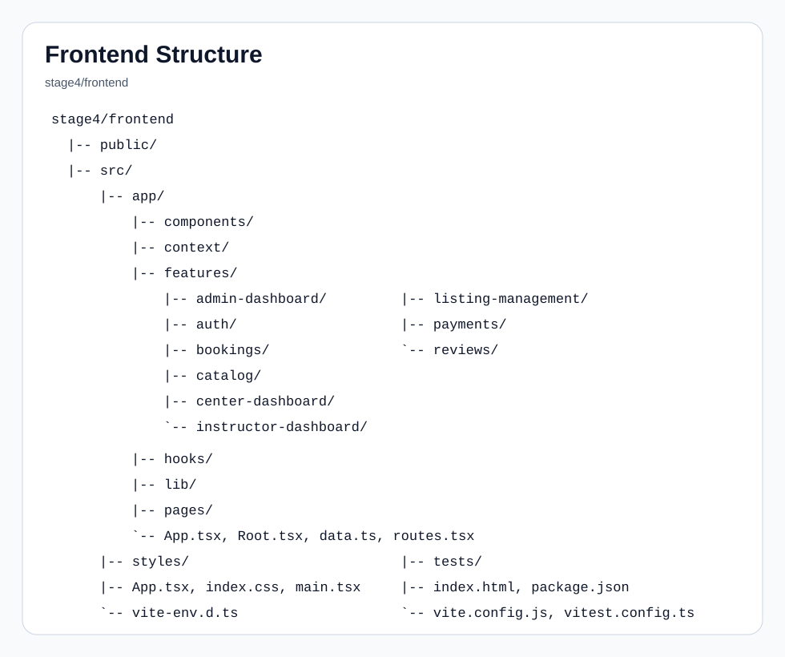
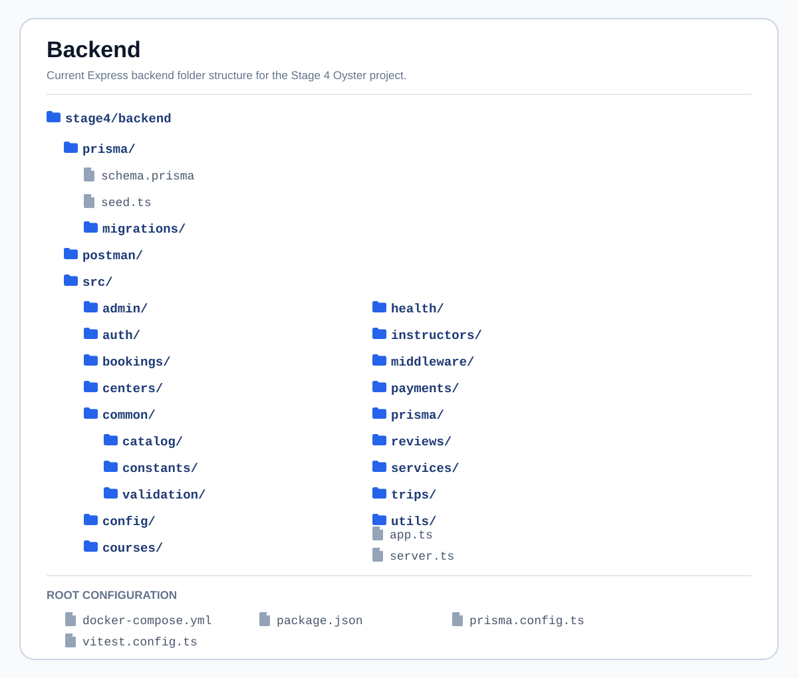

# Oyster Stage 4

Stage 4 delivers the working Oyster application: React frontend, Express API,
PostgreSQL database, authentication, catalogs, dashboards, bookings, reviews,
payments, image upload, seed data, and testing documentation.

This README is feature-based so the team can explain what was built, where the
code lives, which routes belong to each feature, what validation is applied, and
how each feature was tested.

## Table of Contents

- [Current Status](#current-status)
- [Tech Stack](#tech-stack)
- [Run the Project](#run-the-project)
- [Project Structure](#project-structure)
- [Project Delivery Evidence](#project-delivery-evidence)
- [Feature Documentation](#feature-documentation)
- [Testing and Quality](#testing-and-quality)
- [Project Management Links](#project-management-links)
- [Related Documentation](#related-documentation)

## Current Status

| Area | Status | Notes |
|---|---|---|
| Frontend UI pages | Done | Home, catalog pages, details, dashboards, booking, payment callback, auth pages |
| Database and authentication | Done | Prisma schema, PostgreSQL, JWT auth, role-based access |
| Catalog APIs | Done | Centers, trips, courses, search, filters, details, ownership rules |
| Posting trips and courses | Done | Diving centers and instructors can manage their own listings |
| Image upload | Done | Image file validation and Cloudinary upload flow |
| Booking and reviews | Done | Booking creation, cancellation, review creation and filtering |
| Payments | Done | Mock payment mode, payment lookup, admin list, webhook route |
| Admin dashboard | Done | Admin-only data and management actions |
| Seed data | Done | Development users, one diving center, one trip, and one course |
| Testing documentation | Done | Test plan, sprint results, Postman guide, and evidence notes |

## Project Delivery Evidence

| Evidence | Documentation |
|---|---|
| Sprint planning | [Sprint 1](docs/project-management/sprint-01/planning.md) · [Sprint 2](docs/project-management/sprint-02/planning.md) · [Sprint 3](docs/project-management/sprint-03/planning.md) · [Sprint 4](docs/project-management/sprint-04/planning.md) |
| Sprint reviews | [Sprint 1](docs/project-management/sprint-01/review.md) · [Sprint 2](docs/project-management/sprint-02/review.md) · [Sprint 3](docs/project-management/sprint-03/review.md) · [Sprint 4](docs/project-management/sprint-04/review.md) |
| Retrospectives | [Sprint 1](docs/project-management/sprint-01/retrospective.md) · [Sprint 2](docs/project-management/sprint-02/retrospective.md) · [Sprint 3](docs/project-management/sprint-03/retrospective.md) · [Sprint 4](docs/project-management/sprint-04/retrospective.md) |
| Source repository | [Repository workflow](docs/project-management/source-repository.md) · [Pull requests](https://github.com/laradreamer79/Portfolio-Project/pulls) · [develop history](https://github.com/laradreamer79/Portfolio-Project/commits/develop) |
| Bug tracking | [Bug process](docs/project-management/bug-tracking.md) · [GitHub Issues](https://github.com/laradreamer79/Portfolio-Project/issues) |
| Testing evidence and results | [Test plan](docs/testing/test-plan.md) · [Evidence index](docs/testing/evidence/README.md) · [GitHub Actions](https://github.com/laradreamer79/Portfolio-Project/actions) |
| Production environment | [Deployment configuration and verification](docs/deployment/production-environment.md) · [Frontend](https://zeroyster.onrender.com) · [API health](https://oyster-kwn3.onrender.com/api/health) |

## Tech Stack

| Layer | Technology |
|---|---|
| Frontend | React, React Router, Vite, TypeScript, Tailwind CSS, lucide-react |
| Backend | Node.js, Express, TypeScript, Zod, JWT, bcryptjs |
| Database | PostgreSQL, Prisma ORM, Prisma Studio |
| Uploads | Multer, Cloudinary |
| Payments | Moyasar integration with mock payment support |
| Testing | Postman, manual browser testing, typecheck, production build checks |
| Dev tools | Docker Compose, npm scripts, GitHub Issues, GitHub Pull Requests |

## Run the Project

Start Docker and the database:

```bash
cd stage4/backend
docker compose up -d
```

Start the backend API:

```bash
cd stage4/backend
npm install
npm run dev
```

Start the frontend:

```bash
cd stage4/frontend
npm install
npm run dev
```

Useful local URLs:

| Service | URL |
|---|---|
| Frontend | `http://localhost:5173` |
| Backend API | `http://localhost:3000` |
| Health check | `http://localhost:3000/api/health` |
| Prisma Studio | Run `npx prisma studio` from `stage4/backend` |

Seed the database:

```bash
cd stage4/backend
npm run seed
```

## Project Structure

The diagrams and folder trees below replace the old project-structure images
and show the current Stage 4 layout.

<div align="center">

<table>
  <tr>
    <td align="center" width="50%">
      <h3>Frontend Structure</h3>
      
    </td>
    <td align="center" width="50%">
      <h3>Backend Structure</h3>
      
    </td>
  </tr>
</table>

</div>

### Backend

```text
stage4/backend
|-- prisma/
|   |-- schema.prisma
|   |-- seed.ts
|   `-- migrations/
|-- src/
|   |-- admin/
|   |-- auth/
|   |-- bookings/
|   |-- centers/
|   |-- common/
|   |   |-- catalog/
|   |   `-- constants/
|   |-- config/
|   |-- courses/
|   |-- health/
|   |-- instructors/
|   |-- middleware/
|   |-- payments/
|   |-- prisma/
|   |-- reviews/
|   |-- trips/
|   |-- utils/
|   |-- app.ts
|   `-- server.ts
|-- docker-compose.yml
|-- package.json
`-- tsconfig.json
```

### Frontend

```text
stage4/frontend
|-- src/
|   |-- app/
|   |   |-- components/
|   |   |-- context/
|   |   |-- features/
|   |   |   |-- admin-dashboard/
|   |   |   |-- auth/
|   |   |   |-- bookings/
|   |   |   |-- catalog/
|   |   |   |-- center-dashboard/
|   |   |   |-- instructor-dashboard/
|   |   |   |-- listing-management/
|   |   |   |-- payments/
|   |   |   `-- reviews/
|   |   |-- hooks/
|   |   |-- lib/
|   |   `-- pages/
|   |-- assets/
|   |-- index.css
|   `-- main.tsx
|-- package.json
`-- vite.config.ts
```

### Documentation

```text
stage4/docs
|-- deployment/
|-- project-management/
|-- testing/
|   |-- evidence/
|   |-- postman/
|   |-- test-plan.md
|   |-- sprint-01-results.md
|   |-- sprint-02-results.md
|   |-- sprint-03-results.md
|   `-- sprint-04-results.md
|-- api-docs.md
|-- architecture.md
`-- team-how-to-guide.md
```

## Feature Documentation

### Authentication and Role Access

Purpose:
Registers and logs in users, stores JWT tokens on the client, returns the
current logged-in user, and protects role-specific pages and API routes.

| Area | Important Files |
|---|---|
| Backend routes and logic | `backend/src/auth/auth.routes.ts`, `auth.controller.ts`, `auth.service.ts`, `auth.validation.ts`, `auth.token.ts` |
| Backend protection | `backend/src/middleware/auth.middleware.ts`, `role.middleware.ts` |
| Frontend auth | `frontend/src/app/features/auth/`, `frontend/src/app/context/`, `frontend/src/app/hooks/useAuth.ts` |

| Method | Route | Access | Purpose |
|---|---|---|---|
| POST | `/api/auth/register` | Public | Register user, instructor, diving center, or admin seed account |
| POST | `/api/auth/login` | Public | Login and return JWT |
| GET | `/api/auth/me` | Authenticated | Return current logged-in user |

| Validation or Rule | Details |
|---|---|
| Required fields | Name, email, password, role, and role-specific fields |
| Role-specific registration | Instructor requires license data. Diving center requires center details |
| Invalid credentials | Login rejects wrong email or password |
| Authorization | Protected routes read the logged-in user from the token |

| Test | Expected Result | Status |
|---|---|---|
| Register diver/user | Account created and token returned | Pass |
| Register instructor | Instructor profile data saved | Pass |
| Register diving center | Center profile data saved | Pass |
| Login valid account | JWT returned and user redirected by role | Pass |
| Login invalid account | Validation or auth error returned | Pass |
| Access protected route without token | Request blocked | Pass |

### Centers Catalog

Purpose:
Shows diving centers to visitors, supports search and filters, and allows center
owners or admins to manage center data.

| Area | Important Files |
|---|---|
| Backend | `backend/src/centers/centers.routes.ts`, `centers.controller.ts`, `centers.service.ts`, `centers.validation.ts` |
| Shared catalog helpers | `backend/src/common/catalog/`, `backend/src/common/constants/diving-cities.ts` |
| Frontend | `frontend/src/app/pages/Centers.tsx`, `CenterDetail.tsx`, `frontend/src/app/features/catalog/` |

| Method | Route | Access | Purpose |
|---|---|---|---|
| GET | `/api/centers` | Public, optional auth | List approved centers with search and filters |
| GET | `/api/centers/:id` | Public, optional auth | Get center detail |
| POST | `/api/centers` | Diving center, admin | Create center profile with image |
| PUT | `/api/centers/:id` | Owner, admin | Update center profile |
| DELETE | `/api/centers/:id` | Admin | Delete center |

| Validation or Rule | Details |
|---|---|
| Search and filters | City, status, query, and catalog filters are validated |
| Public status behavior | Public routes show approved data only |
| Admin or owner status behavior | Admins and owners can see allowed non-approved records |
| Image | Center image is handled through upload middleware |
| UI update | Centers page follows the trips page style, removes the sidebar, places filters beside search, and removes verified-only |
| Data quality | City and location names should be reviewed for spelling and consistency |

| Test | Expected Result | Status |
|---|---|---|
| View centers page | Approved centers load from API | Pass |
| Search centers | Matching centers appear | Pass |
| Filter by city | Only matching city results appear | Pass |
| Verify all filters | Every center filter returns correct results | Pass |
| Open center detail | Center data, image, trips, courses, and reviews display | Pass |
| Public `status=all` | Non-approved data is not exposed to visitors | Pass |

### Trips Catalog

Purpose:
Shows diving trips, supports details, search, filters, image upload, and owner
management for diving centers and instructors.

| Area | Important Files |
|---|---|
| Backend | `backend/src/trips/` |
| Ownership helpers | `backend/src/common/catalog/catalog-ownership.ts` |
| Validation helpers | `backend/src/common/catalog/catalog-validation.ts` |
| Frontend | `frontend/src/app/pages/Trips.tsx`, `TripDetail.tsx`, `frontend/src/app/features/catalog/` |

| Method | Route | Access | Purpose |
|---|---|---|---|
| GET | `/api/trips` | Public, optional auth | List approved trips with search and filters |
| GET | `/api/trips/:id` | Public, optional auth | Get trip detail |
| POST | `/api/trips` | Diving center, instructor, admin | Create trip and upload image when provided |
| PUT | `/api/trips/:id` | Owner, admin | Update trip |
| DELETE | `/api/trips/:id` | Owner, admin | Delete trip |

| Validation or Rule | Details |
|---|---|
| Required fields | Title, description, city/location, date, price, capacity, difficulty, and image |
| Ownership | Trip can be center-owned through `centerId` or instructor-owned through `instructorId` |
| Trusted owner | API does not trust owner IDs from the request body |
| Case handling | Search and filters handle upper and lower case consistently |
| Public status behavior | Public visitors see approved trips only |

| Test | Expected Result | Status |
|---|---|---|
| View trips | Approved trips load | Pass |
| Search with different case | Same matching results display | Pass |
| Filter trips | Results match selected filters | Pass |
| Create center-owned trip | Trip belongs to logged-in center | Pass |
| Create instructor-owned trip | Instructor can create without `centerId` | Pass |
| Delete own trip | Owner can delete | Pass |
| Delete another owner trip | Request blocked | Pass |
| Admin delete trip | Admin can delete any trip | Pass |

### Courses Catalog

Purpose:
Shows diving courses, supports details, search, filters, image upload, and owner
management for diving centers and instructors.

| Area | Important Files |
|---|---|
| Backend | `backend/src/courses/` |
| Ownership helpers | `backend/src/common/catalog/catalog-ownership.ts` |
| Frontend | `frontend/src/app/pages/Courses.tsx`, `CourseDetail.tsx`, `frontend/src/app/features/catalog/` |

| Method | Route | Access | Purpose |
|---|---|---|---|
| GET | `/api/courses` | Public, optional auth | List approved courses with search and filters |
| GET | `/api/courses/:id` | Public, optional auth | Get course detail |
| POST | `/api/courses` | Diving center, instructor, admin | Create course and upload image when provided |
| PUT | `/api/courses/:id` | Owner, admin | Update course |
| DELETE | `/api/courses/:id` | Owner, admin | Delete course |

| Validation or Rule | Details |
|---|---|
| Required fields | Title, description, city/location, schedule, price, capacity, difficulty, and image |
| Ownership | Course can be center-owned or instructor-owned |
| Trusted owner | API decides ownership from the logged-in user |
| Public catalog | Approved center-owned and instructor-owned courses are visible |

| Test | Expected Result | Status |
|---|---|---|
| View courses | Approved courses load | Pass |
| Search courses | Matching courses display | Pass |
| Create center-owned course | Course belongs to logged-in center | Pass |
| Create instructor-owned course | Instructor can create without `centerId` | Pass |
| Update own course | Owner can update | Pass |
| Delete own course | Owner can delete | Pass |
| Admin delete course | Admin can delete any course | Pass |

### Listing Management Dashboards

Purpose:
Allows diving centers and instructors to add and manage their own trips and
courses from dashboard pages.

| Area | Important Files |
|---|---|
| Center dashboard | `frontend/src/app/pages/CenterDashboard.tsx`, `frontend/src/app/features/center-dashboard/` |
| Instructor dashboard | `frontend/src/app/pages/InstructorDashboard.tsx`, `frontend/src/app/features/instructor-dashboard/` |
| Listing forms | `frontend/src/app/features/listing-management/` |
| Backend catalog APIs | `backend/src/trips/`, `backend/src/courses/`, `backend/src/common/catalog/` |

| Validation or Rule | Details |
|---|---|
| Image upload | Trip and course forms support image upload through multipart form data |
| Center ownership | Diving center listings are linked to the logged-in center |
| Instructor ownership | Instructor listings are linked to the instructor profile and do not require a center |
| Listing visibility | New listings appear in the owner dashboard and catalog when approved |

| Test | Expected Result | Status |
|---|---|---|
| Center adds trip | Trip saved with center owner | Pass |
| Center adds course | Course saved with center owner | Pass |
| Instructor adds trip | Trip saved with instructor owner | Pass |
| Instructor adds course | Course saved with instructor owner | Pass |
| Invalid image type | Validation error displayed | Pass |

### Image Upload

Purpose:
Handles center and listing images when provided and uploads them to Cloudinary.

| Area | Important Files |
|---|---|
| Upload middleware | `backend/src/middleware/upload.middleware.ts` |
| Cloudinary config | `backend/src/config/cloudinary.ts` |
| Listing forms | `frontend/src/app/features/listing-management/` |

| Validation or Rule | Details |
|---|---|
| Accepted upload field | Image is sent as multipart form data |
| Optional listing images | Trip and course creation can attach an uploaded image when provided |
| Cloudinary config | Missing Cloudinary variables fail clearly during upload instead of crashing local startup |
| Catalog display | Uploaded image URL appears on catalog cards and detail pages |

| Test | Expected Result | Status |
|---|---|---|
| Create listing without image | Listing can be created according to current API validation | Pass |
| Upload valid image | Cloudinary URL stored | Pass |
| View catalog card | Uploaded image displays | Pass |
| Missing upload config | Clear upload error returned | Pass |

### Bookings

Purpose:
Lets users create bookings for trips or courses, view their bookings, cancel
their own bookings, and lets admins list bookings.

| Area | Important Files |
|---|---|
| Backend | `backend/src/bookings/` |
| Frontend | `frontend/src/app/features/bookings/`, `frontend/src/app/pages/Booking.tsx`, `BookingDetail.tsx` |

| Method | Route | Access | Purpose |
|---|---|---|---|
| POST | `/api/bookings` | Authenticated | Create booking |
| PATCH | `/api/bookings/:id/cancel` | Owner, admin | Cancel booking |
| GET | `/api/bookings/my` | Authenticated | List current user's bookings |
| GET | `/api/bookings` | Admin | List all bookings |

| Validation or Rule | Details |
|---|---|
| Valid listing | Booking must reference an existing trip or course |
| Invalid booking | Missing or invalid booking data is rejected |
| Ownership | Users can access their own bookings. Admin can access all |

| Test | Expected Result | Status |
|---|---|---|
| Create valid booking | Booking created | Pass |
| Create invalid booking | Validation error returned | Pass |
| View my bookings | User bookings display | Pass |
| Cancel booking | Status updates to cancelled | Pass |
| Admin list bookings | Admin sees booking data | Pass |

### Reviews

Purpose:
Lets users create reviews and lets visitors filter reviews by center, trip, or
course. Admins can manage review records.

| Area | Important Files |
|---|---|
| Backend | `backend/src/reviews/` |
| Frontend | `frontend/src/app/features/reviews/` |
| Admin UI | `frontend/src/app/features/admin-dashboard/` |

| Method | Route | Access | Purpose |
|---|---|---|---|
| POST | `/api/reviews` | Authenticated | Create review |
| GET | `/api/reviews` | Admin | List all reviews |
| DELETE | `/api/reviews/:id` | Admin | Delete review |
| GET | `/api/reviews/center/:centerId` | Public | Reviews for a center |
| GET | `/api/reviews/trip/:tripId` | Public | Reviews for a trip |
| GET | `/api/reviews/course/:courseId` | Public | Reviews for a course |

| Validation or Rule | Details |
|---|---|
| Rating | Rating is validated before saving |
| Target | Review must belong to a center, trip, or course |
| Admin moderation | Admin can list and delete reviews |

| Test | Expected Result | Status |
|---|---|---|
| Create review | Review saved | Pass |
| Invalid review | Validation error returned | Pass |
| Filter center reviews | Only matching center reviews display | Pass |
| Filter trip reviews | Only matching trip reviews display | Pass |
| Filter course reviews | Only matching course reviews display | Pass |
| Admin delete review | Review removed | Pass |

### Payments

Purpose:
Supports payment creation, payment lookup, admin payment listing, mock payment
mode for local testing, and webhook handling.

| Area | Important Files |
|---|---|
| Backend | `backend/src/payments/` |
| Payment gateway | `backend/src/payments/moyasar.gateway.ts` |
| Frontend | `frontend/src/app/features/payments/`, `frontend/src/app/pages/PaymentCallback.tsx` |

| Method | Route | Access | Purpose |
|---|---|---|---|
| POST | `/api/payments` | Authenticated | Create payment |
| GET | `/api/payments/:id` | Owner, admin | Get payment by ID |
| GET | `/api/payments` | Admin | List all payments |
| POST | `/api/payments/webhook` | Public webhook | Receive payment status updates |

| Validation or Rule | Details |
|---|---|
| Payment config | Missing or invalid config returns a clear error |
| Mock mode | Local testing can create mock payments |
| Access control | Users can view their own payment. Admin can view all |
| Webhook | Webhook updates payment status when provider callback is received |

| Test | Expected Result | Status |
|---|---|---|
| Create mock payment | Payment record created | Pass |
| Get payment by ID | Authorized user receives payment | Pass |
| Admin list payments | Admin sees payment data | Pass |
| Webhook callback | Payment status updates | Pass |
| Invalid config | Clear error returned | Pass |

### Admin Dashboard

Purpose:
Provides admin-only access to project data and management actions for centers,
reviews, bookings, payments, and dashboard statistics.

| Area | Important Files |
|---|---|
| Backend | `backend/src/admin/`, `backend/src/middleware/role.middleware.ts` |
| Frontend | `frontend/src/app/pages/AdminDashboard.tsx`, `frontend/src/app/features/admin-dashboard/` |

| Method | Route | Access | Purpose |
|---|---|---|---|
| GET | `/api/admin/dashboard` | Admin | Dashboard summary data |
| GET | `/api/admin/profile` | Admin | Admin profile data |
| PATCH | `/api/admin/profile` | Admin | Update admin profile |
| GET | `/api/bookings` | Admin | List bookings |
| GET | `/api/payments` | Admin | List payments |
| GET | `/api/reviews` | Admin | List reviews |

| Validation or Rule | Details |
|---|---|
| Admin-only access | Non-admin users are blocked |
| Admin actions | Admin controls are connected to backend routes |
| Data views | Admin can inspect center, review, booking, and payment data where available |

| Test | Expected Result | Status |
|---|---|---|
| Admin opens dashboard | Dashboard data loads | Pass |
| Non-admin opens admin route | Access blocked | Pass |
| Admin updates profile | Profile saved | Pass |
| Admin uses action buttons | Backend request runs successfully | Pass |

### Seed Data

Purpose:
Provides repeatable development data instead of manually recreating base records
in Prisma Studio.

| Area | Important Files |
|---|---|
| Prisma seed | `backend/prisma/seed.ts` |
| Schema | `backend/prisma/schema.prisma` |

| Seed Data | Purpose |
|---|---|
| Test user account | Basic user booking and review testing |
| Test instructor account | Instructor ownership and profile testing |
| Test diving center account | Center ownership testing |
| Test admin account | Admin-only route testing |
| One approved diving center | Catalog and center detail testing |
| One approved trip | Trip catalog and booking testing |
| One approved course | Course catalog and booking testing |

| Test | Expected Result | Status |
|---|---|---|
| Run seed script | Data is inserted or updated | Pass |
| Open Prisma Studio | Users, centers, trips, and courses are visible | Pass |
| Open catalog pages | Seeded center, trip, and course appear in the frontend | Pass |

### Health and Error Handling

Purpose:
Confirms the API is running and returns consistent errors for invalid routes,
validation failures, authorization failures, and unexpected server errors.

| Area | Important Files |
|---|---|
| App setup | `backend/src/app.ts`, `backend/src/server.ts` |
| Health | `backend/src/health/` |
| Errors | `backend/src/middleware/error.middleware.ts`, `not-found.middleware.ts`, `backend/src/utils/http-error.ts` |

| Method | Route | Access | Purpose |
|---|---|---|---|
| GET | `/api/health` | Public | API health check |

| Test | Expected Result | Status |
|---|---|---|
| Health check | API returns success | Pass |
| Unknown route | Not found error returned | Pass |
| Validation error | Clear validation response returned | Pass |
| Unauthorized request | Request blocked | Pass |

## Testing and Quality

| Document | Purpose |
|---|---|
| [Test plan](docs/testing/test-plan.md) | Overall testing approach and coverage |
| [Sprint 1 results](docs/testing/sprint-01-results.md) | Frontend UI and routing test results |
| [Sprint 2 results](docs/testing/sprint-02-results.md) | Database and auth test results |
| [Sprint 3 results](docs/testing/sprint-03-results.md) | Catalog, booking, reviews, payment, and integration results |
| [Sprint 4 results](docs/testing/sprint-04-results.md) | Final delivery, documentation, deployment, and regression results |
| [Postman guide](docs/testing/postman/README.md) | API testing checklist and setup notes |
| [Evidence guide](docs/testing/evidence/README.md) | Text evidence notes for testing results |

Recommended verification before opening a pull request:

```bash
cd stage4/backend
npm run typecheck
npm run build

cd ../frontend
npm run typecheck
npm run build
```

Manual verification:

| Area | What to Check |
|---|---|
| Browser | Register, login, role redirects, catalog pages, detail pages, dashboards |
| Postman | Auth, centers, trips, courses, bookings, reviews, payments, admin routes |
| Prisma Studio | Users, instructor profiles, diving centers, trips, courses, bookings, payments, reviews |
| Uploads | Image type validation and Cloudinary URL display |
| Permissions | Owner-only updates/deletes and admin-only routes |

## Project Management Links

| Resource | Link |
|---|---|
| GitHub repository | [Portfolio-Project](https://github.com/laradreamer79/Portfolio-Project) |
| Pull requests | [Repository pull requests](https://github.com/laradreamer79/Portfolio-Project/pulls) |
| Issues | [Repository issues](https://github.com/laradreamer79/Portfolio-Project/issues) |
| Bug tracker | [Bug-labeled issues](https://github.com/laradreamer79/Portfolio-Project/issues?q=is%3Aissue+label%3Abug) |
| Project boards | [Repository projects](https://github.com/laradreamer79/Portfolio-Project/projects) |
| Source repository workflow | [Source repository and workflow](docs/project-management/source-repository.md) |
| Bug tracking process | [Bug tracking](docs/project-management/bug-tracking.md) |

Sprint documentation:

| Sprint | Planning | Review | Retrospective |
|---|---|---|---|
| Sprint 1 | [Planning](docs/project-management/sprint-01/planning.md) | [Review](docs/project-management/sprint-01/review.md) | [Retrospective](docs/project-management/sprint-01/retrospective.md) |
| Sprint 2 | [Planning](docs/project-management/sprint-02/planning.md) | [Review](docs/project-management/sprint-02/review.md) | [Retrospective](docs/project-management/sprint-02/retrospective.md) |
| Sprint 3 | [Planning](docs/project-management/sprint-03/planning.md) | [Review](docs/project-management/sprint-03/review.md) | [Retrospective](docs/project-management/sprint-03/retrospective.md) |
| Sprint 4 | [Planning](docs/project-management/sprint-04/planning.md) | [Review](docs/project-management/sprint-04/review.md) | [Retrospective](docs/project-management/sprint-04/retrospective.md) |

## Related Documentation

- [Team How-To Guide](docs/team-how-to-guide.md)
- [Architecture Notes](docs/architecture.md)
- [Production Environment](docs/deployment/production-environment.md)
- [Mock Image Links](docs/mock-image-links.md)
