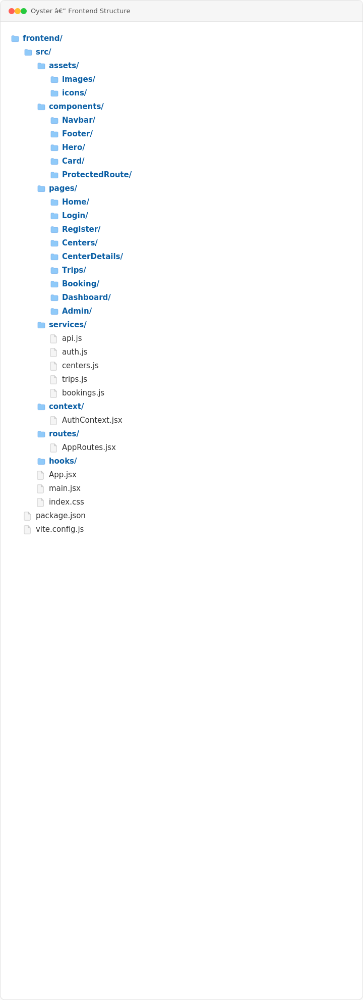
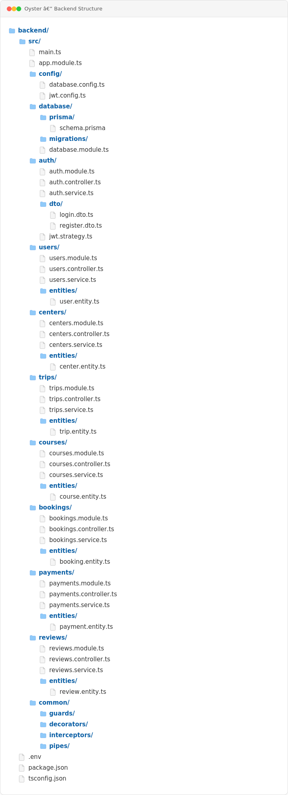

# Stage 4

## Project Structure

The following diagrams show the frontend and backend structure used during Stage 4 implementation.

<table>
  <tr>
    <td align="center" width="50%">
      <h3>Frontend Structure</h3>
      
    </td>
    <td align="center" width="50%">
      <h3>Backend Structure</h3>
      
    </td>
  </tr>
</table>

